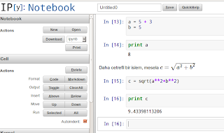

# ipython

Etkilesimli / anlik / canli veri analizi icin cok faydali bir program:
ipython. Bu program aslinda bir shell, yani aynen bash, zsh gibi fakat
ozellikle Python tasarlanmis bir shell, bu sebeple mesela komut
satirinda import yapilabilir, bir Python script dosyasi icine
yazilabilecek her sey satir satir bu shell icinde isletilebilir.

ipython niye faydalidir? Diyelim ki buyuk veri setleri ile is
yapiyoruz, read_csv ile dosya okuduk, sonra Scikits Learn'deki KMeans
ile bir kumeleme islemi yaptik. 100 bin civari satirlarin ustunde
artik bu islemler uzun zaman almaya baslar. Fakat belki yapmak
istedigimiz kumelemeyi bir kere yapip, sonra onun sonuclarini farkli
sekillerde analiz etmek.. Eger her seyi surekli python dosya.py gibi
isletiyorsak, script islemeyi bitirince hafizadaki her sey
kaybolacaktir, uzun suren islemleri her seferinde tekrar bastan
isletmek zorunda kaliriz [1]. Iste ipython burada faydali olur, KMeans
shell icinde isletilir, ve shell bitmeden ayakta durdugu icin,
KMeans'in sonuclari hala hafizada durmaktadir. Artik bu shell icinde
istenen analiz yapilir. Ayrica shell icinde direk hata ayiklayici
(debugger) kullanabilme, hata cikinca daha rahat analiz gibi bir suru
guzel ozelligi vardir. Neyse,

```
$ ipython 
```

ile baslatinca shell'e girilir (yuzde isaretini shell isareti gibi
kabul edelim)

```
%run [dosya.py]
```

ile dosya.py icindeki Python komutlari sanki elle % sonrasi
yaziliyormus gibi isletilebilir, Unix shell'deki "kaynaktan isletme
(sourcing)" kavramina benziyor, yani

. [dosya.sh]

gibi. Matplotlib ile daha entegre sekilde baslatmak icin

```
ipython --pylab 
```

o zaman ayrica matplotlib import etmeye gerek kalmaz, plot komutu
aninda cizimi yapar, normalde bilindigi gibi plt.show() sonrasi normal
Python script blok edecekti.

```
% reset 
```

ile hafiza icerigi temizlenir, soru sorulmadan bu is yapilsin istersek

```
% reset -f
```

Not Defteri

Bir dizi ipython islemini  tarayici icinden yapabilmek, ve hem kodsal,
hem de prezentasyon amaciyla bunlari paylasmak icin ipython "not
defteri" uygulamasi ilginc. Kurmak icin sudo apt-get install
ipython-notebook. Baslatmak icin

```
ipython notebook --pylab=inline
```

Bu bir servis baslatacak, genellikle port 8888 uzerinde isler. Bu
porta baglaninca bir ipython not defterine girmis oluruz. Not defteri
aynen ipython shell gibi etkilesimli (interactive) bir ortamdir, ama
terminal penceresindeki shell yerine bir HTML sayfasindayiz. Tablolar,
grafikler aninda orada gosterilir mesela.. Daha guzel tarafi tum bu
etkilesimin dosyaya kaydedilip paylasilabilmesi; boylece paylasilan
seyler baskalari tarafindan onlarin notebook uygulamasi icine
yuklenebilir, boylece diger kisiler de ayni ipython islem zincirini
gorurler, isterlerse kodla onlar da oynayabilirler, orasini burasini
degistirip sonuclarin farklarina bakabilirler mesela.

Son zamanlarda konferanslarda bu moda haline geldi, ipython not
defteri aciliyor, yeni yapilmis (konferansta anlatilan) her ne var
ise, takir takir not defterine yuklenip islemesi gosteriliyor, sonra
konusma sonrasi bu etkilesim zinciri dosyaya kaydediliyor ve Web
sitesinden herkesle paylasiliyor.

Not defterinde hucreler var, bu hucrelere Python komutlari girilir,
onlari "isletmek" icin Shift+Enter'a basilir. Hucrelere geri donerek
icerikleri degistirilebilir (bu shell ortamina gore bir ilerleme) ve
tekrar Shift+Enter yeni sonuclari verir (o hucrede). Eger bir
degisikligin tum not defterine yansimasini istersek, solda "All" tusu
ile her seyi isletebiliriz.

Not defteri icinde LaTeX kullanmak mumkundur. Kod yazilan hucrede iken
solda "Markdown" secerseniz, yazdiklarini metin olarak kabul edilir ve
iki $ $ isareti arasindaki her sey LaTeX komutu olarak algilanir, ve
Shift + Enter sonrasi aninda grafiksel olarak gosterilir.  Bu tek
kelimeyle muthis bir ozellik, bilimsel hatta egitimsel icerik paylasma
konusunda cok faydali. Bu teknolojiyle interaktif bilimsel kitaplar
yazilabilir, gidisat o yonde.

Eger Ubuntu icinde masaustunde mesela dizinler arasinda gorsel olarak
gezinirken icinde oldugunuz dizinde isleyen bir not defter servisi
baslatmak istersek, $HOME altinda .gnome2/nautilus-scripts dizinine
gidip mesela notebook-server adinda bir dosya yaratiriz, bu dosya
icine

```
#!/bin/sh
cd `echo $NAUTILUS_SCRIPT_CURRENT_URI | sed -e 's/file:\/\///g'`
gnome-terminal -e 'ipython notebook --pylab=inline --no-browser '
```

Dosya uzerinde chmod 755 yapariz (kosturulabilir dosya olur yani), ve
artik Nautilus ile dizinler icinde gezinirken, farede sag tiklama ve
Scripts | notebook-server ile o dizinde bir servis baslatiriz.

Bu arada ipython not defteri ornegini servis tarafini yerel sahsi
makinamizda bir servis uzerinden islettik, ama bu servis aslinda
Internet'te herhangi bir yerde isliyor da olabilir. Demek ki birinden
bir HTML not defteri alip, onu Amazon EC2 gibi bir servisten de ekrana
basiyor olabilirdik. Hatta herkesin erisebilecegi bu tur bir servis
uzerinden bilimsel yayinlarin paylasilmasi mumkun - hakikaten de
bakiyoruz,

http://nbviewer.ipython.org/

gibi bir servis baslamis. Bunlar cok guzel gelismeler. 

---

[1] Tabii ki sonuclari script icinde bir yere kaydedip sonra baska
script icinden geri alabiliriz, fakat bunlar hep ek kodlama
gerektirir.




