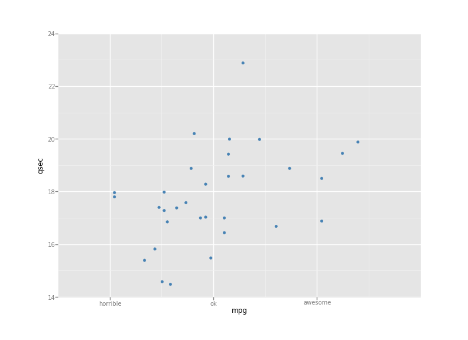
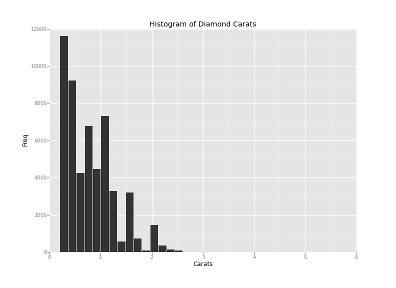
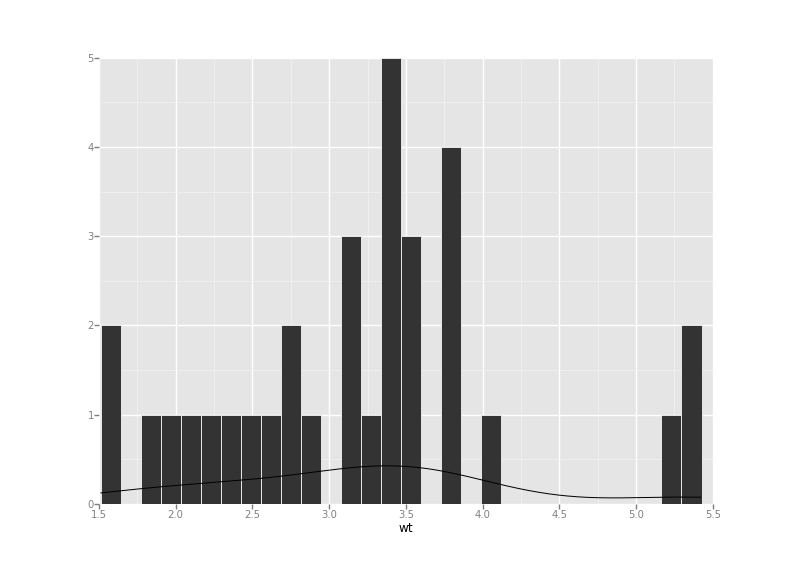

# ggplot

R dilinde cokca kullanilan ggplot2 kutuphanesi nihayet Python'a
tasinmaya baslandi. Kurmak icin,

```
sudo pip install ggplot
```

Matplotlib ile cok zor yapilan isler ggplot2 ile rahat
yapilabiliyor. Kutuphanenin cok ciddi takipcileri / hayranlari var,
ozellikle daha once R ile kodlama yapmis olan istatistikciler ve
bilimciler. Bu kisilerin cok sevdigi bir ozellik bir grafigin kesit
kesit (layer by layer) ust uste konarak tasarlanabilmesi. Bu yaklasima
gore grafik noktalari bir kesit, yazilari bir baska kesit, eksen
boyutlari bir baska kesit olabilir mesela, ve bu ekler hep benzer
cagrilarla yapilir (burada + isareti kullanilmis olmasi raslanti
degil). Kutuphane, Leland Wilkinson'un Grafigin Grameri adli
yaklasiminin kodlanmis halidir; yani grafiklemenin dili boyle
olmalidir seklinde bir yaklasimdir bu -- oldukca iddialidir.

Ornek,

```
from ggplot import *
print mtcars[:3]
            name
   mpg
  cyl
  disp
   hp
  drat
     wt
   qsec
  vs
  am
  gear
  carb0
      Mazda RX4
  21.0
    6
   160
  110
  3.90
  2.620
  16.46
   0
   1
     4
     41
  Mazda RX4 Wag
  21.0
    6
   160
  110
  3.90
  2.875
  17.02
   0
   1
     4
     42
     Datsun 710
  22.8
    4
   108
   93
  3.85
  2.320
  18.61
   1
   1
     4
     1[3 rows x 12 columns]
```

Ilk grafik

```
from ggplot import *
p = ggplot(mtcars, aes('mpg', 'qsec'))
p = p + geom_point(colour='steelblue') + \
     scale_x_continuous(breaks=[10,20,30], \
     labels=["horrible", "ok", "awesome"])
plt = p.draw()
plt.show()
```

Goruldugu gibi her sey kesit kesit ekleniyor. Histogram

```
p = ggplot(aes(x='carat'), data=diamonds)
gg = p + geom_histogram() + gg
title("Histogram of Diamond Carats") + labs("Carats", "Freq")
plt = gg.draw()
plt.show()
```

Histogram ve onun uzerine eklenmis egri

```
p = ggplot(aes(x='wt'),mtcars) + geom_histogram() + geom_density()
```

Beyzbol verisi uzerinde

df = pd.read_csv("baseball-pitches-clean.csv")
df = df[['pitch_time', 'inning', 'pitcher_name', 'hitter_name', 'pitch_type',          'px', 'pz', 'pitch_name', 'start_speed', 'end_speed', 'type_confidence']]
print df.head()
                  pitch_time  inning
       pitcher_name
    hitter_name
  \0
  2013-10-01 20:07:43 -0400
       1
  Francisco Liriano  Shin-Soo Choo
   1  2013-10-01 20:07:57 -0400
       1  Francisco Liriano  Shin-Soo Choo
   2  2013-10-01 20:08:12 -0400
       1  Francisco Liriano  Shin-Soo Choo
   3  2013-10-01 20:08:31 -0400
       1  Francisco Liriano
  Shin-Soo Choo
   4
  2013-10-01 20:09:09 -0400
       1
  Francisco Liriano
   Ryan Ludwick
  
  pitch_type
     px
     pz pitch_name  start_speed  end_speed  type_confidence  0
          B  0.628  1.547
   Fastball
         93.2
       85.3
            0.894  1
          S
  0.545
  3.069
   Fastball
         93.4
       85.6
            0.895
  2
          S
  0.120
  1.826
     Slider
         89.1
       82.8
            0.931  3
          S -0.229  1.667
     Slider
         90.0
       83.3
            0.926
  4
          B -1.917
  0.438
     Slider
         87.7
       81.6
            0.915
  [5 rows x 11 columns]
```

Grafikleme

```
p = ggplot(aes(x='start_speed'), data=df) + geom_histogram() + facet_wrap('pitch_name')
plt = p.draw()
plt.show()
```









