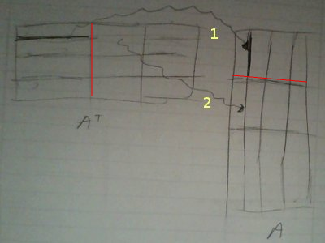
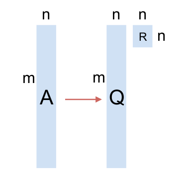

# Lineer Cebir ve Hadoop

### Paralel A'A

Öncelikle elimizdeki becerilere (capabilities) bakalım. Hadoop ortamı
bize aşırı büyük bir dosyayı otomatik olarak makinalara bölerek bir
hesap yapılması gerektiğinde o hesabın her makinadaki veri parçası
üzerinde yaptırılabilmesini sağlıyor.

A'A örneğinde eldeki veri A, ve "çok olan" A'nin satırları, yani m x n
boyutlarında matris var ve m devasa boyutlarda (olabilir). Bir A
dosyası tipik olarak şöyle gözükecek:

```
!head -5 A_matrix
```

```
3 4 5 6
3 4 5 2
3 6 7 8
2 2 2 2
9 9 3 3
```

Eşle/indirgeye gelelim: Eğer çarpıma satır bakışını hatırlarsak,



Bu bakışa göre soldaki matriste satır boyunca giderken, sağdakinde ona
tekabül eden kolon boyunca gidiyoruz, ve birbirine eşlene her ögeyi
çarpıyoruz, ve çarpımları topluyoruz.

Şimdi bu matrisin Hadoop'ta parça parça bize geldiğini düşünürsek (ki üstte
hayali bir ilk parçayı kırmızı çizgi ile belirttik), bu parça içinde mesela ilk
satırı kendisi ile çarparken (1'inci ok) aynı blok içindeyiz. Bu önemli bir
nokta, çarparken bloklar arası geçiş yok.

Tabii ki nihai çarpımdaki (1,1) hesabı için $A^T$'deki birinci satırın {\em
  tamamen} $A$'daki birinci kolonla nokta çarpımının bitirilmiş olması gerekir,
ama şimdi düşünelim, başka bir makinaya ikinci parça verilmiş ise, makinada o
birinci satırın geri kalanı çarpılıp toplanacaktır (2. ok), ve eğer tüm
parçalar, tüm makinalarda bu şekilde işlenirse, (1,1) hesabı için o
makinalardaki o tüm çarpımları alıp nihai bir noktada toplamak bize (1,1) için
nihai sonucu verecektir. Bu tipik bir eşle/indirge hesabı olabilir, eşle
safhasında eldeki parça $A_p$ üzerinde $A_p^T A_p$ yapılır, indirge safhasında
bu parçalar toplanır.

Eşleme safhasından yayınlanacak (emit) anahtar ve değerler, bizce, $A_p^T A_p$
içindeki her satırın satır no'su ve satır değeri olmalı. Niye? (Aynı sabit bir
anahtar değeriyle beraber $A_p^T A_p$'in tamamını da yayınlayabilirdik).

Hatırlayalım, nihai çarpım $n \times n$ boyutunda, her parça $p$ olsa bile, $n
\times p \cdot p \times n$ yine bize $n \times n$ veriyor. Yani her makina $n
\times n$ boyutunda bir çarpım sonucunu üretiyor. Evet $n$ nispeten küçük bir
sayı, fakat yine de onbinlerde olsa bile $10,000 \times 10,000$ mesela, büyük
bir sayı. Eğer tüm toplamı tek bir indirgeyici makinaya yaptırırsak, pek çok $n
\times n$ boyutunda matrisin toplamı bu makinayı kaşar. O sebeple indirgeme
sonrası matrisleri değil, o matrislerin her $n$ satırını satır no'su ile
yayınlıyoruz, böylece aynı satırlar aynı indirgeyiciye gidip orada
toplanıyorlar, ama birçok indirgeyici var yani toplama işlemi paralel hale
gelmiş oluyor. Tabii indirgeme sonrası o sonuçlar yayınlanıyor, ve satır no'ya
göre doğal olarak sıralanmış halde nihai sonuç çıkıyor.  Ama toplama işlemi
paralel. Kod alttaki gibi

```python
from mrjob.job import MRJob
from mrjob.protocol import PickleProtocol
import numpy as np, sys

class MRAtA(MRJob):
    INTERNAL_PROTOCOL = PickleProtocol
    
    def __init__(self, *args, **kwargs):
        super(MRAtA, self).__init__(*args, **kwargs)
        self.buffer_size = 4
        self.n = 4
        self.data = []
        self.A_sum = np.zeros((self.n,self.n))
        
    def mapper(self, key, line):
        line_vals = map(np.float,line.split())
        self.data.append(line_vals)
        if len(self.data) == self.buffer_size:
            mult = np.dot(np.array(self.data).T,np.array(self.data))
            self.data = []
            for i, val in enumerate(mult):
                yield i, val        
    
    def reducer(self, i, tokens):
        for val in tokens:
            self.A_sum[i,:] += np.array(val)
        yield i, str(self.A_sum[i,:])

    '''
    At the end of processing a file, we might have some left over
    rows in self.data that were not multiplied because we did not
    reach buffer size. That condition is handled here. Whatever is
    left over, is simply multiplied and emitted.
    '''
    def mapper_final(self):        
        if len(self.data) > 0:
            mult = np.dot(np.array(self.data).T,np.array(self.data))
            for i, val in enumerate(mult):
                yield i, val        

    
if __name__ == '__main__':
    MRAtA.run()
```

Fonksiyon `mapper_final` MRJob kurallarına göre bir makinadaki tüm
eşleme bittikten sonra çağırılır, biz bu çengeli (hook), "artık
parçaları çarpıp yayınlamak için" kullandık, her parça $p$
büyüklüğünde, ama m / p tam sayı olmayabilir, yani işlem sonunda bazı
artık veriler kalmış olabilir, onları `mapper_final` içinde
çarpıyoruz.

Bu arada kodun kendi içinde de bir "parçalama", "biriktirme ve işleme" yaptığına
dikkat, yani 20,000 satır olabilir, iki tane eşleyici var ise her eşleyici bu
verinin 10,000 satırını işler, ama ayrıca işleyiciler daha ufak ufak (üstte 4)
parçalarla çarpım yapıyor.

```
!python AtA.py A_matrix
```

```
using configs in /home/burak/.mrjob.conf
creating tmp directory /tmp/AtA.burak.20131202.225802.256844
writing to /tmp/AtA.burak.20131202.225802.256844/step-0-mapper_part-00000
Counters from step 1:
  (no counters found)
writing to /tmp/AtA.burak.20131202.225802.256844/step-0-mapper-sorted
> sort /tmp/AtA.burak.20131202.225802.256844/step-0-mapper_part-00000
writing to /tmp/AtA.burak.20131202.225802.256844/step-0-reducer_part-00000
Counters from step 1:
  (no counters found)
Moving /tmp/AtA.burak.20131202.225802.256844/step-0-reducer_part-00000 -> /tmp/AtA.burak.20131202.225802.256844/output/part-00000
Streaming final output from /tmp/AtA.burak.20131202.225802.256844/output
0	"[ 420.  463.  264.  265.]"
1	"[ 463.  538.  351.  358.]"
2	"[ 264.  351.  316.  321.]"
3	"[ 265.  358.  321.  350.]"
removing tmp directory /tmp/AtA.burak.20131202.225802.256844
```

Karşılaştırmak için aynı işlemi tek bir script içinde yapalım, 

```python
A = np.loadtxt('A_matrix')
print np.dot(A.T,A)
```

```
[[ 420.  463.  264.  265.]
 [ 463.  538.  351.  358.]
 [ 264.  351.  316.  321.]
 [ 265.  358.  321.  350.]]
```

Tıpatıp aynı. 

Şimdi bu sonuç üzerinde Cholesky yapalım

```python
import numpy.linalg as lin
print lin.cholesky(np.dot(A.T,A))
```

```
[[ 20.49390153   0.           0.           0.        ]
 [ 22.59208669   5.25334361   0.           0.        ]
 [ 12.88188096  11.41585875   4.44244436   0.        ]
 [ 12.93067597  12.53849977   2.54158031   4.37310096]]
```

Bu bize L'yi verdi. Karşılaştırmak için A üzerinde direk `qr` yapalım

```python
q,r = lin.qr(A)
print r.T
```

```
[[-20.49390153   0.           0.           0.        ]
 [-22.59208669  -5.25334361   0.           0.        ]
 [-12.88188096 -11.41585875   4.44244436   0.        ]
 [-12.93067597 -12.53849977   2.54158031  -4.37310096]]
```

Bu matris Cholesky sonucunun eksi ile çarpılmış hali, fakat bu nihai
sonuç açısından farketmiyor.

Q



Q hesabı için biraz daha takla atmak lazım,

A = QR

AR^-1 = QRR^-1

Q = AR^-1

Demek ki R'i elde ettikten sonra onu tersine çevirip (inverse) A ile
çarparsak, bu bize Q'yu verecek. Dert değil, R ufak bir matris, n x n,
ve tersini alma operasyonu pahalı bir işlem olsa da bu boyutlarda
yavaş olmaz. Daha sonra bu R^-1'i alıp bu sefer başka bir eşle/indirge
ile çarpım işlemine tabi tutarız. R'yi direk alttaki script içine
yazdık (B olarak) bir sonuç ortamında bu verinin başka bir şekilde
MRJob işlemine verilmiş olması lazım. Bir işleme zinciri var, zincirde
önce A'A, Cholesky, oradan $R$ alınıp başka bir işleme (job)
aktarılıyor.

```python
from mrjob.job import MRJob
from mrjob.protocol import PickleProtocol
import numpy as np, sys

class MRAB(MRJob):
    INTERNAL_PROTOCOL = PickleProtocol
    
    def __init__(self, *args, **kwargs):
        super(MRAB, self).__init__(*args, **kwargs)
        self.buffer_size = 4
        self.n = 4
        self.data = []
        # an example B
        self.B = np.array([[-20.49390153,   0.        ,   0.        ,   0.        ],
                           [-22.59208669,  -5.25334361,   0.        ,   0.        ],
                           [-12.88188096, -11.41585875,   4.44244436,   0.        ],
                           [-12.93067597, -12.53849977,   2.54158031,  -4.37310096]])

        
    def mapper(self, key, line):
        line_vals = map(np.float,line.split())
        self.data.append(line_vals)
        if len(self.data) == self.buffer_size:
            mult = np.dot(self.data,self.B.T)
            self.data = []
            yield (key, mult)
    
    def reducer(self, key, tokens):
        for x in tokens:
            yield (key, str(x))
    
if __name__ == '__main__':
    MRAB.run()

```

```
!python AB.py A_matrix
```

```
using configs in /home/burak/.mrjob.conf
creating tmp directory /tmp/AB.burak.20131202.230008.985111
writing to /tmp/AB.burak.20131202.230008.985111/step-0-mapper_part-00000
Counters from step 1:
  (no counters found)
writing to /tmp/AB.burak.20131202.230008.985111/step-0-mapper-sorted
> sort /tmp/AB.burak.20131202.230008.985111/step-0-mapper_part-00000
writing to /tmp/AB.burak.20131202.230008.985111/step-0-reducer_part-00000
Counters from step 1:
  (no counters found)
Moving /tmp/AB.burak.20131202.230008.985111/step-0-reducer_part-00000 -> /tmp/AB.burak.20131202.230008.985111/output/part-00000
Streaming final output from /tmp/AB.burak.20131202.230008.985111/output
null	"[[ -61.48170459  -88.78963451  -62.09685608  -84.98432736]\n [ -20.49390153  -27.8454303   -19.85529535  -27.30069639]\n [ -40.98780306  -55.6908606   -39.7105907   -54.60139278]\n [-184.44511377 -250.6088727  -205.35232431 -234.71714361]]"
null	"[[ -61.48170459  -99.29632173  -76.04368486 -131.21677204]\n [ -40.98780306  -55.6908606   -39.7105907   -54.60139278]\n [-184.44511377 -250.6088727  -205.35232431 -234.71714361]\n [ -61.48170459  -88.78963451  -62.09685608 -102.4767312 ]]"

null	"[[ -61.48170459  -88.78963451  -62.09685608 -102.4767312 ]\n [ -61.48170459  -88.78963451  -62.09685608  -84.98432736]\n [ -61.48170459  -99.29632173  -76.04368486 -131.21677204]\n [ -40.98780306  -55.6908606   -39.7105907   -54.60139278]]"
removing tmp directory /tmp/AB.burak.20131202.230008.985111
```

Kontrol edelim,

```python
B = np.array([[-20.49390153,   0.        ,   0.        ,   0.        ],
              [-22.59208669,  -5.25334361,   0.        ,   0.        ],
              [-12.88188096, -11.41585875,   4.44244436,   0.        ],
              [-12.93067597, -12.53849977,   2.54158031,  -4.37310096]])
print np.dot(A,B.T)
```

```
[[ -61.48170459  -88.78963451  -62.09685608 -102.4767312 ]
 [ -61.48170459  -88.78963451  -62.09685608  -84.98432736]
 [ -61.48170459  -99.29632173  -76.04368486 -131.21677204]
 [ -40.98780306  -55.6908606   -39.7105907   -54.60139278]
 [-184.44511377 -250.6088727  -205.35232431 -234.71714361]
 [ -61.48170459  -99.29632173  -76.04368486 -131.21677204]
 [ -40.98780306  -55.6908606   -39.7105907   -54.60139278]
 [-184.44511377 -250.6088727  -205.35232431 -234.71714361]
 [ -61.48170459  -99.29632173  -76.04368486 -131.21677204]
 [ -40.98780306  -55.6908606   -39.7105907   -54.60139278]
 [-184.44511377 -250.6088727  -205.35232431 -234.71714361]
 [ -61.48170459  -88.78963451  -62.09685608 -102.4767312 ]
 [ -61.48170459  -88.78963451  -62.09685608  -84.98432736]
 [ -20.49390153  -27.8454303   -19.85529535  -27.30069639]
 [ -40.98780306  -55.6908606   -39.7105907   -54.60139278]
 [-184.44511377 -250.6088727  -205.35232431 -234.71714361]
 [ -81.97560612 -116.63506481  -90.83704015 -126.11438629]]
```

Çarpımlar aynı. Yanlız dikkat, satırların sırası değişik olabilir,
burada problem eşle/indirge işleminin $A$'yi parçalama sonucu her
çarpım parçasının değişik bir sırada ele geçiyor olması. Eğer
sıralamayı aynı $A$ gibi istiyorsak, bu sıra no'sunu $A$ verisi içinde
ilk satıra koymak lazım ve eşleyiciler oradan alıp bu no'yu anahtar
olarak yayınlamalılar. Bu eklemeyi okuyucuya bırakıyorum!

Şimdi QR hesabını bu şekilde yapıp yapamayacağımızı kontrol
edelim. Eğer `qr` ile Q hesaplarsak,

```python
q,r = lin.qr(A)
print q
```

```
[[-0.14638501 -0.13188879  0.36211188 -0.35057934]
 [-0.14638501 -0.13188879  0.36211188  0.56410341]
 [-0.14638501 -0.51259871 -0.16600517 -0.02328772]
 [-0.09759001  0.03897744  0.26737941 -0.1251395 ]
 [-0.43915503  0.1753985  -0.14740047  0.02394349]
 [-0.14638501 -0.51259871 -0.16600517 -0.02328772]
 [-0.09759001  0.03897744  0.26737941 -0.1251395 ]
 [-0.43915503  0.1753985  -0.14740047  0.02394349]
 [-0.14638501 -0.51259871 -0.16600517 -0.02328772]
 [-0.09759001  0.03897744  0.26737941 -0.1251395 ]
 [-0.43915503  0.1753985  -0.14740047  0.02394349]
 [-0.14638501 -0.13188879  0.36211188 -0.35057934]
 [-0.14638501 -0.13188879  0.36211188  0.56410341]
 [-0.048795    0.01948872  0.1336897  -0.06256975]
 [-0.09759001  0.03897744  0.26737941 -0.1251395 ]
 [-0.43915503  0.1753985  -0.14740047  0.02394349]
 [-0.19518001 -0.11240007  0.04559899 -0.21745867]]
```

R'in tersi ile A carpilinca hakikaten Q elde ediliyor mu?  Kontrol
edelim.

```python
print np.dot(A,lin.inv(B.T))
```

```
[[-0.14638501 -0.13188879  0.36211188 -0.35057934]
 [-0.14638501 -0.13188879  0.36211188  0.56410341]
 [-0.14638501 -0.51259871 -0.16600517 -0.02328772]
 [-0.09759001  0.03897744  0.26737941 -0.1251395 ]
 [-0.43915503  0.1753985  -0.14740047  0.02394349]
 [-0.14638501 -0.51259871 -0.16600517 -0.02328772]
 [-0.09759001  0.03897744  0.26737941 -0.1251395 ]
 [-0.43915503  0.1753985  -0.14740047  0.02394349]
 [-0.14638501 -0.51259871 -0.16600517 -0.02328772]
 [-0.09759001  0.03897744  0.26737941 -0.1251395 ]
 [-0.43915503  0.1753985  -0.14740047  0.02394349]
 [-0.14638501 -0.13188879  0.36211188 -0.35057934]
 [-0.14638501 -0.13188879  0.36211188  0.56410341]
 [-0.048795    0.01948872  0.1336897  -0.06256975]
 [-0.09759001  0.03897744  0.26737941 -0.1251395 ]
 [-0.43915503  0.1753985  -0.14740047  0.02394349]
 [-0.19518001 -0.11240007  0.04559899 -0.21745867]]
```

Sonuçlar birebir aynı.

Üstteki teknikleri kullanarak artık devasa boyutlarda satırı olan bir
$A$ matrisi üzerinde artık QR hesabı yapılabilir.


