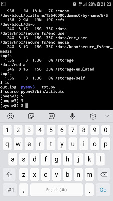
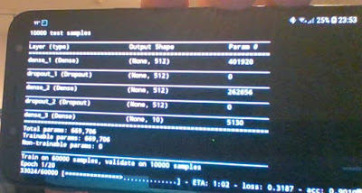

# Android Uzerinde Linux - Termux

Android işletim sisteminin temeli Linux işletim sistemidir, en azından
çekirdek seviyesinde bu böyle. Peki madem böyle niye Ubuntu'da, ya da
diğer Debian bazlı sistemlerde olduğu gibi apt-get, python, ruby,
komutlari ile ya da Flask gibi uygulamalari kurup, geliştirmeyi direk
Android telefonu üzerinde yapamıyoruz? Hatta cep telefonları artık
iyice kuvvetlendi, dizüstü bilgisayarı atsak, sadece cep telefonu
üzerinde geliştirme yapsak?

Bunların yapılamamasının sebebi Linux temelli olsa da Android'de her
şeyi Java bazlı işletebilmek için katman üzerine katman koyarak Linux
baz sisteminden uzaklaşılmış olması. Fakat bazıları bayağı uğrarak
Linux temelli geliştirmeyi Android'e taşımışlar. Google Play'den
indirilebilecek bir uygulama Termux.

Termux'a bir "app" demek basit kaçar aslında, daha çok bir başlangıç
kabuğu denebilir, Termux bize telefon içinde bir komut satırı verir,
bu satırda apt install ya da pkg install ile ek uygulamaları Ubuntu'da
olduğu gibi kurarız. Mesela apt-install python gibi. Termux'u yazanlar
bir sürü Linux bazlı programı bu şekilde Android için hazır hale
getirmişler. Liste tüm programları kapsamıyor, ama şaşırtıcı derecede
faydalı programlar var. C++ icin clang, ya da Tex icin texlive hatta
emacs! Ben denedim, yeterince buyuk ekran var ise cep telefon üzerinde
emacs rahatca kullaniliyor. Tabii Samsung bu baglamda DevX sistemi ile
/ gibi dışarıdan bir Bluetooth klavyesi bağlayıp görüntüyü bir büyük
ekrana yansıtacak türden kullanım dusunuyor, ki bu tür kullanım başta
değindiğimiz pür cep telefon bazlı geliştirmedir.

Python sistemi daha once bahsedildigi gibi mevcut, pkg install python3
ardından, pip install virtualenv deriz, ve python3 için bir sanal
ortam yaratabiliriz. Cep telefonu üzerinde virtualenv'e girmek
bazılarımızı şaşırtabilir. Fakat işliyor.




Sanal ortama girince burada pip install ile ipython, numpy, scipy
kurabiliriz. Bazı paketlerde sorun çıkabilir, mesela zmq için bizde
bir sorun çıktı ki bu sorun jupyter ile de yasanabilir, once pgk
install libzmq libzmq-dev python-dev libcrypt-dev kurulur. Ardından,
eğer zmq import edilmesi problem veriyorsa, komut satırına çıkıp ana
dizinde bir .bash_profile dosyası yaratıp onun içine alttakini
yazarız,

`export LD_PRELOAD=$LD_PRELOAD:"/data/data/com.termux/files/usr/lib/libzmq.so"`

exit ile Termux'dan çıkıp tekrar girersek, artık zmq çalışıyor olacak.

Paketler pandas, matplotlib icin ek bazi kurma islemleri

`pkg install clang freetype-dev libpng-dev python2-dev`

Matpotlib icin `$HOME/.config/matplotlib/matplotlibrc` icinde `backend :
agg` yazmak lazim, komut satirindan cikip tekrar girin, sonra

`LDFLAGS=" -lm -lcompiler_rt -lpython" pip install cython pandas matplotlib`

Eger Python 2 ortami icin kurulum yapiliyorsa ustteki  -lpython2.7 yapilabilir.

Geri Surum Paket

"Dışarısı" ile Dosya Paylaşmak

Termux kendi izole alanında işliyor. Eğer Android ana dizinlerine
Termux komut satırından erişmek istersek,  `termux-setup-storage`
deriz, izin isteyen diyalog kutusu gelince ona 'allow (izin ver)'
deriz. Artık ana dizinde bir `storage` adlı bir alt dizin olacak, bu
alt dizine bakınca içinde downloads, movies, music gibi Anroid'in
bilinen dizinlerini göreceğiz. Bu dizinlere yazılan her dosya dışarıda
da gözükecektir. Ya da ters yönde oraya yazılan Termux'da okunur.

`ssh` var, dışarı bağlanılıp envai türden iş yapılabilir. Kimisi web
geliştirmeyi DevX üzerinden direk telefonda yapıyor, flask, django
var, mikroservis ya da apache başlatılabilir, yerel servis yerel
tarayıcı ile ziyaret edilip sayfalar, servis tarafı kodu test
edilebilir.

Veri tabanlarına bağlanmak için PostgreSql var. `pkg install
postgresql-dev python-dev make clang`, ve python seviyesinde pip
install `psycopg2`. Yok yok.

Tüm Termux dizinlerini yedeklemek için

https://wiki.termux.com/wiki/Backing_up_Termux

Latex

pkg install texlive ile kapsamli bir TeX kurulabilecegini gorduk. Ama
ekler icin TeX paket sistemi ile kurulus mumkun, tlmgr install
[paket]. Ama ayri ayri her paket kurmak yerine daha rahati

```
tlmgr install collection-fontsrecommended
tlmgr install collection-latexextra
tlmgr install collection-mathscience
```

isletmek.

Scipy

Bu paket cok kritik, mesela statsmodels icin lazim. Fakat pip install
ile kurulumda problem cikiyor. Termux'ta paket

pkg install scipy

ile kurulabilir. Fakat böyle yapınca kurulum global python için
oluyor, virtualenv ortamlarında nasıl görülecek? Bunu basit bir
sembolik bağlantı ile halledebiliriz, global python'a girip import
scipy ve print (scipy) derseniz kütüphane yeri gösterilecek. Bu adresi
alıp mesela `env3/lib/site-packages` altında `ln -s` ile bağlantılarsanız
(ki scipy dizini orada görülsün) scipy işleyecektir.

Simdi bir puruz ortaya cikabilir; Eger pip install keras ile kurulus
yapmaya calisirsak bazen bu ve benzeri paketler scipy'in zaten kurulu
oldugunun farkedemeyebiliyorlar. Bu durumda bu
paketleri `--no-dependencies` secenegi ile kurmak lazim. Tabii boyle
olunca gercekten ihtiyac olan paketleri kurmadan atlayacaktir, keras
durumunda bu paketleri teker teker elle kurmak lazim. Mesela

```
pip install theano --no-dependencies
pip install keras-applications --no-dependencies
pip install keras-preprocessing --no-dependencies
```

Tum bunlardan sonra keras ayni sekilde kurulur.

Keras icin arka plan hesap motorunu theano sectirmek icin kodun en
basinda alttaki kullanilabilir.

```
import os; os.environ['KERAS_BACKEND'] = 'theano'
```

Arka plan motor Tensorflow da olabilir, ona girmiyorum, cunku Termux
ile problem cikti. Fakat Keras isliyorsa (theano uzerinden) bu yeterli
olabilir. Altta basit ornek bir YSA'yi Keras ile telefonum uzerinde
egitirken goruyoruz.




Pillow

Her paketin sanki Termux'a has bir kurulus sekli var :) Pillow
kurulumu hata verirse,

`pkg install python python-dev libjpeg-turbo-dev libcrypt-dev ndk-sysroot clang`

```
LDFLAGS="-L/system/lib/" CFLAGS="-I/data/data/com.termux/files/usr/include/" pip install Pillow
```

h5py

Keras'in modellerini kaydettigi h5 formati icin `pkg
install libhdf5-dev` ve `pip install h5py`.

Samsung

Fakat Termux yine de izole bir ortam. Docker'vari daha geniş kapsamlı
Linux işletmek için Samsung kolları sıvadı ve Linux on Galaxy adlı bir
proje üzerinde çalışıyorlar. Bu şekilde telefon, tablet sahibi
geliştiricileri kendilerine çekmeye uğraşıyorlar, ekonomik kısmı
mantıklı.

Ekler

İki sene bu ortamda yoğun şekilde çalıştıktan sonra şunu
söyleyebilirim, Termux'u servis bazlı bile olarak tamamen Linux yerine
geçirmek çok zor. Bu tür ihtiyaçlara (tamamen mobil, hafif bilgisayar)
en iyi seçenek [Raspberry Pi](../../2020/07/raspberrypi.md). Pi tam
tekmilli bir Ubuntu Linux'tur, hafiftir, Wifi'ni otomatik bağlanacak
şekilde hep açık tutarsak ve cep telefonu Wifi paylaşımı hotspot
üzerinden İnternet erişimi sağlarsak, yerel ağ da oluşturabiliriz, ve
telefondan ssh, scp ile bağlanıp 'servis' olarak RPi kullanabiliriz.
Bluetooth klavye + Telefon + Pi tasinabilir bir Linux ortami saglar. 


