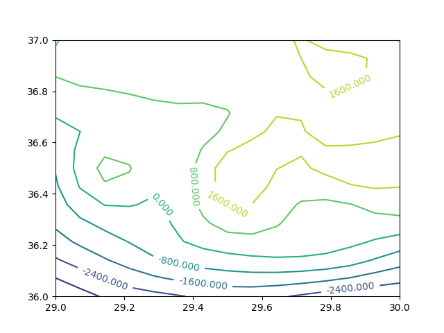

# Yükseklik (Elevation) Verileri

Hangi servis ile yükseklik verisi alınır? Google Elevation servisi
var, belli miktarda kullanım için bedava, sonrası için fiyatlı. Google
Console'dan proje yaratıp projede elevation servisini aktif hale
getirmek lazım, bundan sonra proje API kodunu kullanıp ES çağrılabilir.

### Google

```python
from urllib.request import urlopen
import polyline, json

elev_query = "https://maps.googleapis.com/maps/api/elevation/json?" + \
	      "locations=enc:%s&key=%s"
#key = "[ANAHTAR DEGERI]"
locs = [[40.994252, 29.037847],[40.991771, 29.061873]]
locs = polyline.encode(locs)
url = elev_query % (locs, key)
html = urlopen(url)
json_res = json.loads(html.read().decode('utf-8'))
print (json_res)
```

```text
{'status': 'OK', 'results': [{'resolution': 610.8129272460938,
'location': {'lng': 29.03785, 'lat': 40.99425}, 'elevation':
9.726478576660156}, {'resolution': 610.8129272460938, 'location':
{'lng': 29.06187, 'lat': 40.99177}, 'elevation': 58.94558334350586}]}
```

### Velroutes (Bedava)

Bir diğer seçenek veloroutes.org adresi; burada arkadaş bedava servis
veriyor; onun sayfalarından "kazıyarak" istenen veriyi alabiliriz,


```python
import re

url = "http://veloroutes.org/elevation/?" + \
      "location=41.40000%2C28.15000&units=m"
html = urlopen(url)
res = html.read().decode('utf-8')
p = "Elevation for .*? <span style=\"font-size\:20px\">(\d*)</span> meters"
rres = re.findall(p,res)
print (float(rres[0]))    
```

```text
215.0
```

Bir diğeri elevation.racemap.com adresinden; bu arkadaşlar da bedava
servis veriyorlar, Curl kullanıp

```python
! curl -d '[[51.3, 13.4], [51.4, 13.3]]' -XPOST \
  -H 'Content-Type: application/json' \
  https://elevation.racemap.com/api
```

```text
  % Total    % Received % Xferd  Average Speed   Time    Time     Time  Current
                                 Dload  Upload   Total   Spent    Left  Speed
  0     0    0     0    0     0      0      0 --:--:-- --:--:-- --:--:--     0100    37  100     9  100    28      8     27  0:00:01  0:00:01 --:--:--    27100    37  100     9  100    28      8     27  0:00:01  0:00:01 --:--:--    27
[101,100]
```

Bu komutu tabii ki sarmalayıp sonucu bir yere yazdırıp Python ile
güzel liste döndürmesi için ayarlayabiliriz. Ya da `requests`
kullanarak aynı çağrıyı yapabiliriz,

```python
import requests

headers = {  'Content-Type': 'application/json', }
data = '[[51.3, 13.4], [51.4, 13.3]]'
response = requests.post('https://elevation.racemap.com/api',
                         headers=headers, data=data)
print(response.text)
```

Daha Çetrefil Kullanım

Alttaki örnekte bir kordinat alanıda 7 x 7 büyüklüğünde bir ızgara yaratıyoruz,
o ızgara öğe kordinatları için yükseklik verisini alıyoruz, ve RBF tekniği [1]
ile aradeğerleme (interpolation) yaparak yüksekliği yaklaşık şekilde temsil
ediyoruz. 


```python
import requests

def get_elev_data(coords):
    chunk = [list(x) for x in coords]
    data = "["
    for i,x in enumerate(chunk):
        data += str(x)
        if i != len(chunk)-1: data += ","
    data += "]"
    response = requests.post('https://elevation.racemap.com/api',
                             headers={'Content-Type': 'application/json',},
                             data=data)
    res = response.text
    res = res.replace("]","").replace("[","")
    res = res.split(",")
    res = [float(x) for x in res]
    return res

```

Veri alındı, şimdi RBF,

```python
from scipy.interpolate import Rbf

latlow = 36; lathigh = 37
lonlow = 29; lonhigh = 30

D = 7
x = np.linspace(lonlow,lonhigh,D)
y = np.linspace(latlow,lathigh,D)
xx,yy = np.meshgrid(x,y)
xxf = xx.reshape(D*D)
yyf = yy.reshape(D*D)
sampleCoords = []
for yyy,xxx in zip(yyf,xxf):
    sampleCoords.append([yyy,xxx])
sampleCoords = np.array(sampleCoords)
print (sampleCoords.shape)

zr =  np.array(get_elev_data(sampleCoords))

yr = sampleCoords[:,0]
xr = sampleCoords[:,1]

rbfi = Rbf(xr,yr,zr,function='multiquadric')
```

```text
(49, 2)
```

Şimdi RBF kullanarak daha yüksek çözünürlü bir ızgara için yüksekliği
aradeğerleme ile hesaplatabiliriz, altta 15 x 15 büyüklüğünde bir ızgara
için bunu yapıyoruz,

```python
D = 15
x = np.linspace(lonlow,lonhigh,D)
y = np.linspace(latlow,lathigh,D)
xx,yy = np.meshgrid(x,y)
yhat = rbfi(xx,yy)

fig, ax = plt.subplots()
CS = ax.contour(xx,yy,yhat)
plt.clabel(CS, inline=1, fontsize=10)
plt.savefig('elev1.png')
```



<a name='geotiff'/>

### DEM, GeoTiff

Yüksekliği gösteren ısı / renk haritaları görmüşüzdür, daha yüksek
yerler daha kırmızımsı, daha alçaklar daha koyu gibi. Eh piksel
yükseklik gösteriyorsa ve pikselleri depolayan teknolojimiz de oldukca
ileriyse, aynı işi yükseklik verisi kodlamak için de
kullanabiliriz. DEM, GeoTiff formatı bunu yapar. Dünya verisi [2]'de,
Zıpped DEM GeoTiff indirilir, okumak için [3]. Örnek (İtalya'da bir
yer)

```python
from geotiff import GeoTiff 
import matplotlib.pyplot as plt

tiff_file = "/tmp/alwdgg.tif"

area_box = ((10, 45), (11, 46))

g = GeoTiff(tiff_file, crs_code=4326, as_crs=4326,  band=0)
arr = g.read_box(area_box)
arr = np.flip(arr,axis=0)
print (arr.shape)

X = np.linspace(area_box[0][0],area_box[1][0],11)
Y = np.linspace(area_box[0][1],area_box[1][1],11)
X,Y = np.meshgrid(X,Y)

CS=plt.contour(X,Y,arr)
plt.clabel(CS, fontsize=10, inline=1)
plt.savefig('elev2.png')
```

```text
(11, 11)
```


`area_box` içinde alt sol köse ve üşe sağ köşe verildi, bu bir kutu oluşturdu,
ve o kutu içine düşen yükseklik verisi `read_box` ile alındı.

[2] verisinin çözünülürlüğü en yüksek olduğu yerde "1 dakika" olarak verilmiş,
yani aşağı yukarı 1 km x 1 km karelerinin yükseklik verisi alınabilir. Dosyanin
büyüklüğüne dikkat çekmak lazım, 20 MB'dan daha az!

[3] kullanımı önemliydi çünkü bazı alternatif GeoTiff okuma yöntemleri GDAL
kurulmasının gerektiriyor, [3] kütüphanesi gayet hafif, direk DEM dosyalarının
içeriğini okuyabiliyor.

Kaynaklar

[1] [RBF](https://burakbayramli.github.io/dersblog/stat/stat_175_rbf/dairesel_baz_fonksiyonlari__radial_basis_functions_rbf__yukseklik_verisi_daglar.html)

[2] World digital elevation model (ETOPO5), https://www.eea.europa.eu/data-and-maps/data/world-digital-elevation-model-etopo5

[3] https://github.com/KipCrossing/geotiff


