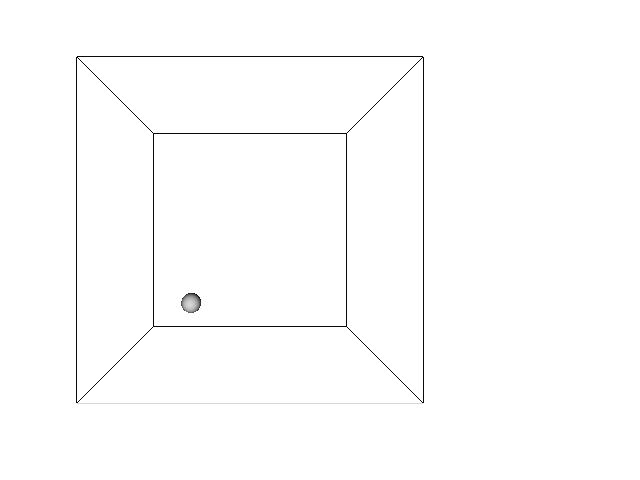

# OpenGL, PyOpenGL

3 boyutlu simülasyonlar için ÖpenGL ünlü bir paket. Çeşitli objeler,
satıhlar, onları gösteren bir kamera gibi kavramların kodlaması
basit. Birkaç örnek C++ kodunu [SPH](sph.md) yazısında gördük. Ek bazı
kodlar [2]'den alınmıştır,

[bouncingballs.cpp](glcode/bouncingballs.cpp),
[checkeredtriangles.cpp](glcode/checkeredtriangles.cpp),
[colorcube.cpp](glcode/colorcube.cpp),
[cometride.cpp](glcode/cometride.cpp),
[fish.cpp](glcode/fish.cpp),
[litsolids.cpp](glcode/litsolids.cpp),
[moon.cpp](glcode/moon.cpp),
[robotarm.cpp](glcode/robotarm.cpp),
[sierpinski2d.cpp](glcode/sierpinski2d.cpp),
[sierpinski3d.cpp](glcode/sierpinski3d.cpp),
[spinningsquare.cpp](glcode/spinningsquare.cpp),
[tetrahedron.cpp](glcode/tetrahedron.cpp),
[torus.cpp](glcode/torus.cpp),
[triangle.cpp](glcode/triangle.cpp)

Derlemek icin

```
sudo apt-get install mesa-common-dev libgl1-mesa-dev libglu1-mesa-dev freeglut3-dev
```

Sonra

```
g++ dosya.cpp -lX11 -lGL -lGLU -lglut -g -Wall -O2 -o islet.exe
```

Şu dizinde [2]'den alınan bir uçuş simülatörü bile var!

[fly.cpp](glcode/flight/fly.cpp)
[geometry.h](glcode/flight/geometry.h)
[landscape.cpp](glcode/flight/landscape.cpp)
[landscape.h](glcode/flight/landscape.h)
[ship.h](glcode/flight/ship.h)

Derlemek icin

```
g++ -c landscape.cpp -o landscape.o -lX11 -lGL -lGLU -lglut -g -Wall -O2 
g++ fly.cpp -g -Wall -O2 -o r.exe -lX11 -lGL -lGLU -lglut landscape.o
```

Python

Kurulus

```
pip install PyOpenGL==3.1.0
```

[1] kodu baz alınarak bir topun düşüşünü, duvarlara, yere çarpmasını
simüle eden bir kod altta görülüyor. Top sayısını `self.n` ile
arttırabiliriz.

```python
from OpenGL.GL import *
from OpenGL.GLU import *
from OpenGL.GLUT import *
from random import random
from PIL import Image
from PIL import ImageOps
import sys

class Simulation:
    def __init__(self):
        self.i = 0
        self.n   = 1
        self.r   = 0.1
        self.g   = 9.8
        self.dt  = 0.01
        self.cor = 0.6
        self.balls = []
        self.tm  = 0.0
        self.th  = 0.0
        self.mmax =  1.0-self.r
        self.mmin = -1.0+self.r
        self.rt = False
        
    def init(self):
        for i in range(self.n):
            p = [
                self.mmin + random()*(self.mmax-self.mmin),
                self.mmin + random()*(self.mmax-self.mmin),
                0.9]
            v = [
                -1.5 + random()*3.0,
                -1.5 + random()*3.0,
                -1.0 + random()*2.0]
            self.balls.append({'pos':p,'vel':v})
        tm = 0.0

        glEnable(GL_LIGHTING)
        glEnable(GL_LIGHT0)
        glEnable(GL_DEPTH_TEST)
        glClearColor(1.0,1.0,1.0,1.0)

        glMatrixMode(GL_PROJECTION)
        glLoadIdentity()
        gluPerspective(60.0,1.0,1.0,50.0)
        glTranslatef(0.0,0.0,-3.5)
        glMatrixMode(GL_MODELVIEW)
        glLoadIdentity()

    def update(self):
        for b in self.balls:
            b['vel'][2] += -self.g*self.dt
            b['pos'][0] += b['vel'][0]*self.dt
            b['pos'][1] += b['vel'][1]*self.dt
            b['pos'][2] += b['vel'][2]*self.dt

            if (abs(b['pos'][0]) >= self.mmax):
                b['vel'][0] *= -self.cor
                if b['pos'][0] < 0:
                    b['pos'][0] = self.mmin
                else:
                    b['pos'][0] = self.mmax

            if (abs(b['pos'][1]) >= self.mmax):
                b['vel'][1] *= -self.cor
                if b['pos'][1] < 0:
                    b['pos'][1] = self.mmin
                else:
                    b['pos'][1] = self.mmax

            if (abs(b['pos'][2]) >= self.mmax):
                b['vel'][2] *= -self.cor
                if b['pos'][2] < 0:
                    b['pos'][2] = self.mmin
                else:
                    b['pos'][2] = self.mmax

        if self.rt:
            self.th += 0.2
            if self.th>360.0:
                self.th -= 360.0

        glutPostRedisplay()

    def display(self):
        glClear( GL_COLOR_BUFFER_BIT | GL_DEPTH_BUFFER_BIT)
        glPushMatrix()
        glRotatef(self.th,0.0,1.0,0.0)
        glRotatef(90.0,-1.0,0.0,0.0)
        glutWireCube(2.0)
        for b in self.balls:
            glPushMatrix()
            glTranslatef(b['pos'][0],b['pos'][1],b['pos'][2])
            glutSolidSphere(self.r,50,50)
            glPopMatrix()
        glPopMatrix()
        glutSwapBuffers()

        if self.i % 40 == 0: 
            width,height = 640,480
            data = glReadPixels(0, 0, width, height, GL_RGBA, GL_UNSIGNED_BYTE)
            image = Image.frombytes("RGBA", (width, height), data)
            image = ImageOps.flip(image) # in my case image is flipped top-bottom for some reason
            image.save('/tmp/glutout-%03d.png' % self.i, 'PNG')
        self.i += 1

        

    def mouse(self,button,state,x,y):
        if button == GLUT_LEFT_BUTTON:
            rt = not state
        elif button == GLUT_RIGHT_BUTTON:
            sys.exit(0)

if __name__ == '__main__':
    s = Simulation()
    glutInit(())    
    glutInitDisplayMode(GLUT_DOUBLE | GLUT_RGB | GLUT_DEPTH)
    glutInitWindowSize(500,500)
    glutCreateWindow("GLUT Bouncing Ball in Python")
    glutDisplayFunc(s.display)
    glutIdleFunc(s.update)
    glutMouseFunc(s.mouse)
    s.init()
    glutMainLoop()
```

Sonuc




Dikkat üstteki kodda duvar çarpım fiziği var fakat topların birbirine
çarpma fiziği yok.


Kaynaklar

[1] http://fab.cba.mit.edu/classes/864.05/people/knorton/01-balls/

[2] https://cs.lmu.edu/~ray/notes/openglexamples/
