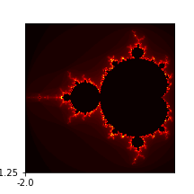

# GPU, CUDA, PyCuda

Bilgisayarımızda hesapları yapan işlemci var, bu işlemci son
zamanlarda çok çekirdekli hale de gelmeye başladı. Fakat
bilgisayarımızda işlem yapan çok kuvvetli bir parça daha var: grafik
işlemci (GPU).GPU paralel işlem açısından neredeyse pür mikroişlemci
kadar kuvvetlidir, hatta bazı açılardan daha hızlıdır, çünkü tarihsel
sebeplerle parallelliğe daha fazla yatkın olması gerekmiştir. GPU bir
görüntünün hızla çizilmesi (rendering) için piksel bazında paralelliğe
gitmek zorundaydı ve NVİDİA şirketinin ürünleri için artık bu normal
bir operasyondur.

Araştırmacılar bu paralellikten istifade etmeye karar vermişler, ve
grafiksel olmayan hesap işlemlerini sanki öyleymiş gibi GPU'ya
sunuyorlar, ve cevabı geri tercüme ediyorlar, böylece GPU'nun hızlı
paralel işlemci özelliğinden faydalanıyorlar. Pek çok matematiksel
hesabı bu şekilde yaptıran olmuş, mesela matris çarpımı, PDE çözümü,
simülasyon.

NVidia şirketi grafik kartlarının GPU'suna erişim için CUDA diye bir
kütüphane sağlıyor. Onun üstüne PyCUDA ile Python bazlı erişim de
var. Bazı ülkelerin üniversitelerinde CUDA eğitimini müfredata dahil
edilmiş. Dikkat: NVidia kartı piyasadaki grafik kartlarından bir
tanesidir, her laptop üzerinde NVidia olmayabilir (fakat NVidia
piyasadaki en ünlülerden birisi, bunu da ekleyelim). Şimdilik GPU
kodlaması için NVidia kartına sahip bir bilgisayar lazım.

Fakat GPU bazlı kodlama oldukca popüler hale geldi ki video kart
üreticisi NVidia dışarıdan bilgisayara dahil edilebilen ayrı bir ufak
GPU ünitesi bile yarattı. Ünitenin ismi Jetson kartı.

https://developer.nvidia.com/buy-jetson

Kart üzerinde Ubuntu işleyebiliyor, network aktarıcısı (router) dahil
edilip hemen ssh ile alete bağlanabiliyorsunuz. Yapay öğrenim ile
uğraşanlar için müthiş haber GPU üzerinde mevcut 192 çekirdek aşırı
seviyede paralellik isteyen deep learning yaklaşımı için biçilmiş
kaftan, ki burada birisi denemiş, ve nasıl yapılabileceği
anlatılıyor. Blog sahibi Pete Warden imaj üzerinde yapay öğrenim
algoritmaları kullanma konusunda uzmanlardan biridir, bu iş için
kurduğu şirketini geçende Google satın aldı. Tabii ki Jetson üzerinde
direk CUDA kodlaması da yapılabilir.

Geliştiriciler için bir diğer seçenek Google bulutu üzerinde
barındırılan not defteri servisi [Google Collab](../../2018/11/gpu-tpu-saglayan-not-defter-ortami.md).
Bu servis [Jupyter](../../2018/09/jupyter-not-defterleri.md)
teknolojisine İnternet üzerinden erişim sağlıyor denebilir.

Bu yazida GPU kodlama ornekleri CUDA uzerinden olacak.

CUDA

Pek çok türde paralelellik, eşzamanlılaştırma tekniği var. Mesela disk
bazlı çalışan [eşle/indirge](../../2014/09/esle-indirge-mimarisi-mapreduce-mr.md)
bunlardan biri. Her teknik paralleliği hangi birim üzerinde, nerede,
ne zaman yaptırdığı bağlamında birbirinden farklı. GPU kodlaması ŞİMD
yaklaşımını benimser, SIMD = Single Instruction Multiple Data, yani
Tek Komut Pek Çok Veri yaklaşımı.

SIMD ile bir işlem, ki bu çarpma, toplama, vs gibi temel işlemler ya
da onların toplamı olan bir hesap ünitesi olabilir, birden fazla veri
noktası üzerinde aynı anda uygulanır. Bu yaklaşımın grafik kartları,
grafikleme için nasıl faydalı olacağını görmek zor değil, çünkü grafik
kartları için veri, görüntü pikselleri, ve her piksel üzerinde, resim
kare kare oluşturulurken tek bir işlemi aynı anda uygulamak faydalı
olur. Bu işlem transformasyon olabilir, ki aynı matrisi çarpmayı
gerektirir, işin takip etme (ray traçıng) olabilir, vs.

CUDA ve Collab

Collab'a girip bir not defteri yaratalım, ve menüde `Edit | Notebook
settings` seçelim, burada `Hardware accelerator` seçimi var. Bu seçimi
`GPU` haline getirelim. Bu kadar basit! Arka plandaki bir GPU
havuzundan Google size bir GPU atamış olacaktır.

Dikkat: Jupyter üzerinden GPU kullanımı direk kendi kartımız üzerinden
kullanıma oranla yavaş olablir. Ama 10/20 kat hızlandırmayı hala
Google Collab ile deneyimlemek mümkün.


Şimdi `pycuda` kuralım. Bu işlemi aynı not defterini ilk kez
açtığımızda her seferinde tekrar yapmamız lazım. Çünkü arka planda
bize Google tarafından bir makina atanıyor, ve eski makinanın kurulumu
yokolmuş, yeni bir makinada, yeni bir süreçteyiz.

```
!pip install pycuda
```

Acaba makinamızda ne tür bir GPU var?

```python
import pycuda.driver as drv
drv.init()

for i in range(drv.Device.count()):
    gpu_device = drv.Device(i)
    print ('Device {}: {}'.format( i, gpu_device.name() ))
    compute_capability = float( '%d.%d' % gpu_device.compute_capability() )
    print ('\t Compute Capability: {}'.format(compute_capability))
    print ('\t Total Memory: {} megabytes'.format(gpu_device.total_memory()//(1024**2)))
```

```
Device 0: Tesla T4
	 Compute Capability: 7.5
	 Total Memory: 15079 megabytes
```

En basit islemle baslayalim. Bir vektor uzerindeki sayilari 2 ile carpalim.

```python
from time import time
from pycuda import gpuarray

host_data = np.array(range(10**7),dtype=np.float32)

device_data = gpuarray.to_gpu(host_data)

t1 = time()
device_data_x2 = np.float(2) * device_data
t2 = time()
host_data_x2 = device_data_x2.get()
print ('GPU %0.8f saniye.' % (t2-t1))
  
t1 = time()
host_data_x2_cpu = host_data * np.float(2)
t2 = time()

print ('CPU %0.8f saniye.' % (t2-t1))
```

```
GPU 0.00174046 saniye.
CPU 0.00841069 saniye.
```

GPU ile CPU arasında 8 kat civarı fark var, 10 milyon tane sayıyı
ikiye çarpmak için.

Not 1: Jupyter ortamında pycuda kodlarının daha yavaş işlediği
tecrübelenmiştir, bu hız karşılaştırmasını nihai olarak görmemek
lazım.

Not 2: pycuda bir kodu ilk işlettiğinde onu bir derleme sürecinden
geçirir, ama ikinci sefer aynı kodu görünce bunu yapmaz [1]. Bu
sebeple ikinci, üçüncü, vs. işletim daha hızlı olacaktır.

Kodu incelersek `gpuarray.to_gpu` ile GPU'ya veriyi gönderdik. Daha
sonra `np.float(2) * device_data` ile çarpma işlemi GPU üzerinde
yapıldı. Tabii arka planda Python bazı tutkallama işi yaptı mesela `*`
işlemi büyük ihtimalle belli tipler için üste tanımlı (overloaded), ve
`gpuarray` gibi özel tipler söz konusu olunca arka planda GPU üzerinde
ek işlemler yapılacağı biliniyor. 

Yapılan işlem çarpma, ve GPU bu her çarpma işlemini aynı anda, mümkün
olduğu kadar fazla vektör öğesi üzerinde işletti.

Çekirdek (Kernel) Kullanımı

Daha direk bir yöntemi görelim. Aslında CUDA kodları çekirdek temelli
işler, dışarıdan programcının verdiği bir çekirdek veri üzerinde
(mümkün olduğu kadar paralel bir şekilde) işletilir / uygulanır. Bu Python'un
`map`, ya da Pandas `apply` operasyonu gibi.

```python
import numpy as np
import pycuda.autoinit
from pycuda import gpuarray
from time import time
from pycuda.elementwise import ElementwiseKernel

host_data = np.float32( np.random.random(10**7) )

gpu_2x_ker = ElementwiseKernel(
"float *in, float *out",
"out[i] = 2*in[i];",
"gpu_2x_ker")

t1 = time()
host_data_2x =  host_data * np.float32(2)
t2 = time()
print ('CPU: %f' % (t2 - t1))
device_data = gpuarray.to_gpu(host_data)
device_data_2x = gpuarray.empty_like(device_data)
t1 = time()
gpu_2x_ker(device_data, device_data_2x)
t2 = time()
from_device = device_data_2x.get()
print ('GPU: %f' % (t2 - t1))
```

```
CPU: 0.007268
GPU: 0.079255
```

Üstte `ElementwiseKernel` objesine üç tane parametre verdik. Bunlardan
ilki çekirdeğe / fonksiyona verilecek parametreler. İlki giriş verisi,
ikincisi çıkış verisi, sözdizim C dili sözdizimine benziyor dikkat
edilirse, C ile `*ptr` ile tanımlanan değişkene `ptr[0]`, `ptr[1]`, vs
ile erişilebilir, göstergeç aritmetiği uygulanabilir.

Ayrıca çıkış vektörünün verisini "içeriden" alabilmek için
`gpuarray.empty_like` ile onu dışarıda önceden tanımlamamız
gerekti.. Bu vektöre bir yer açtık, o yerdeki vektörün değerleri GPU
tarafından dolduruldu.

Metodun ana kodu ikinci parametrede, burada giriş vektör öğesi
üzerinde hangi işlem yapılıp hangi çıkış öğeye atandığı
kodlanıyor. İndis `i` vektör öğesine erışılıyor, kod işlediğinde her
çekirdek eşzamanlı olarak tek bir öğe üzerinde işlem yapacak, buna
dikkat. GPU parallelliğinin temeli bu.

Mandelbrot Kümesi

Fraktal resimleri üretmek için Mandelbrot yaklaşımı kullanılabilir, 

```python
import pandas as pd
import numpy as np
import matplotlib.pyplot as plt


def mandelbrot_numpy(q, maxiter):
    output = np.resize(np.array(0,), q.shape)
    z = np.zeros(q.shape, np.complex64)
    for it in range(maxiter):
        z = z*z + q
        done = np.greater(abs(z), 2.0)
        q = np.where(done, 0+0j, q)
        z = np.where(done, 0+0j, z)
        output = np.where(done, it, output)
    return output

def mandelbrot_set2(xmin,xmax,ymin,ymax,width,height,maxiter):
    r1 = np.linspace(xmin, xmax, width)
    r2 = np.linspace(ymin, ymax, height)
    q = np.ravel(r1 + r2[:,None]*1j)
    n3 = mandelbrot_numpy(q,maxiter)
    n3 = n3.reshape((width,height))
    return n3.T

xmin,xmax,ymin,ymax = -2.0,0.5,-1.25,1.25

width=3;height=3;maxiter=80;cmap='hot'

dpi = 72

img_width = dpi * width; img_height = dpi * height

z = mandelbrot_set2(xmin,xmax,ymin,ymax,img_width,img_height,maxiter)

fig, ax = plt.subplots(figsize=(width, height),dpi=72)
ticks = np.arange(0,img_width,3*dpi)
x_ticks = xmin + (xmax-xmin)*ticks/img_width
plt.xticks(ticks, x_ticks)
y_ticks = ymin + (ymax-ymin)*ticks/img_width
plt.yticks(ticks, y_ticks)
ax.imshow(z.T,cmap=cmap,origin='lower')
plt.savefig("cuda3.png")
```




```python
import numpy as np
import pycuda.autoinit
from pycuda import gpuarray
from pycuda.elementwise import ElementwiseKernel

mandel_ker = ElementwiseKernel(
"pycuda::complex<float> *lattice, float *mandelbrot_graph, int max_iters, float upper_bound",
"""
mandelbrot_graph[i] = 1;

pycuda::complex<float> c = lattice[i]; 
pycuda::complex<float> z(0,0);

for (int j = 0; j < max_iters; j++)
{    
   z = z*z + c;
     
   if(abs(z) > upper_bound) {
       mandelbrot_graph[i] = 0;
       break;
    }
}         
""",
"mandel_ker")

width, height, real_low, real_high, imag_low, imag_high, max_iters, upper_bound =  512,512,-2,2,-2,2,256, 2

real_vals = np.matrix(np.linspace(real_low, real_high, width), dtype=np.complex64)

imag_vals = np.matrix(np.linspace( imag_high, imag_low, height), dtype=np.complex64) * 1j

mandelbrot_lattice = np.array(real_vals + imag_vals.transpose(), dtype=np.complex64)    

mandelbrot_lattice_gpu = gpuarray.to_gpu(mandelbrot_lattice)

mandelbrot_graph_gpu = gpuarray.empty(shape=mandelbrot_lattice.shape, dtype=np.float32)

mandel_ker( mandelbrot_lattice_gpu, mandelbrot_graph_gpu, np.int32(max_iters), np.float32(upper_bound))
          
mandelbrot_graph = mandelbrot_graph_gpu.get()   
```

```python
from matplotlib import pyplot as plt
fig = plt.figure(1)
plt.imshow(mandelbrot_graph, extent=(-2, 2, -2, 2))
```


Kaynaklar

[1] Tuomanen, *Hands-On GPU Programming with Python and CUDA*

[2] https://colab.research.google.com/

[3] https://gist.github.com/jfpuget/60e07a82dece69b011bb


