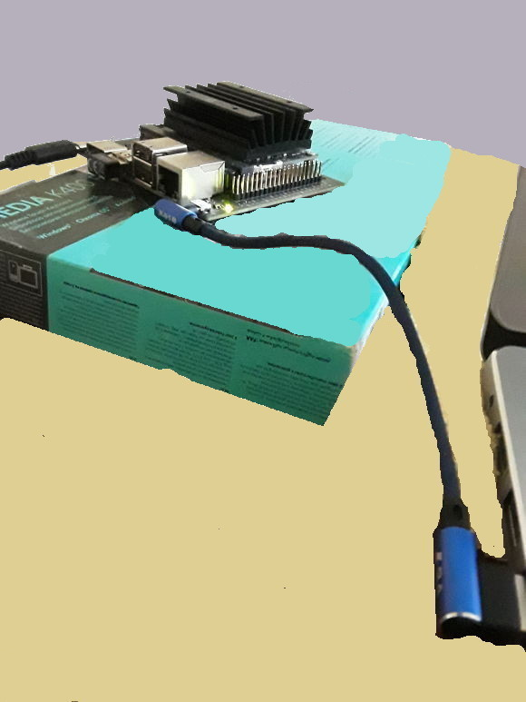

# Jetson Nano

GPU geliştirmesi için Jetson Nano ürünü var, Türkiye'de 100 dolar
civarı fiyatla satılıyor. Altta görülen Nano 2GB Wifi ürünü.

Güç kaynağı bu pakete dahil değil, 5 Volt, 3 Amperlik bir adaptor
almak lazım. Raspberry Pi uyumlu bu tür adaptörler var.

Paketten iki tane ek kablo çıkacak, bunlardan birinin ucunda bir ufak
"döngle" var, üzerinde CE yazıyor, bu Wifi özelliği sağlıyor, alttaki
resimde devrenin sol altında. Diğer kablo bir ucu dizüstüne, diğeri
Nano'ya takılacak, nihai resim



İşletim sistemi mikro SD kart üzerinden, en az 64 GB iyi olur,
işlemler aynen [Raspberry Pi](../07/raspberrypi.md) durumunda olduğu
gibi. Orada olduğu gibi yine işletim sistemi indirilecek, ve SD'ye
"yakılacak".

https://developer.nvidia.com/jetson-nano-2gb-sd-card-image

Şöyle bir komutla indirebilir,

```
wget --continue https://developer.download.nvidia.com/assets/embedded/downloads/jetson-nano-2gb-jp441-sd-card-image/jetson-nano-2gb-jp441-sd-card-image.zip
```

Buyuk bir dosya dikkat. Indirildikten sonra yakmak icin Etcher adli
bir program kullanilir,

Etcher

https://www.balena.io/etcher/

https://phoenixnap.com/kb/etcher-ubuntu

Bir zıp indiriliyor, zıp açıliyor içinde işler bir program var,
tıklanır, görsel programla yakma yapılır. Nano imajı seçilir, hedef
seçilir, yak denilir.

Yakma işlemi bitince kart Nano'ya sokulur, bağlantılar yapılır, ve
HDMİ üzerinden monitöre bağlanıp, ayrıca fare, klavye Nano'ya
bağlanılıp kuruluma devam edilir. Orada isim, kullanıcı ismi, şifre,
coğrafi yer vs sorulacak, bunlar girilir. Wifi bağlantısı burada
görülür, Wifi şifresi girilip bağlantı kurulur.

Aradaki o mavi kablo üzerinden bir seri bağlantıya dikkat,
dizüstündeki Ubuntu üzerinde

```
$ dmesg | grep --color 'tty'
[106921.687362] cdc_acm 1-2:1.2: ttyACM0: USB ACM device
```

deyince üsttekini görebilmek lazım.  Ya da `ls /dev/tty*` ile bakarsak
orada bir `/dev/ttyACM0` olmalı. Bu seri bağlantının sürekli olmalı
gerekli, yoksa Wifi üzerinden bile `ssh` çalışmaz.

Şimdi 


```
sudo screen /dev/ttyACM0 115200
```

seri bağlantı üzerinden ile sisteme girebiliriz, dediğimiz gibi bu
bağlantı hep lazım. Oradan `ifconfig -a` ile sistemin IP adresini
alırız, ben tüm ek işlemleri `ssh kullanıcı@IP` ile Nano'ya ssh
üzerinden girip, ayrı bir ekranda yapıyorum.

Yeni sistemimizi kontrol edelim. `ssh` ile girip,

```
sudo nvpmodel -q

NVPM WARN: fan mode is not set!
NV Power Mode: MAXN
0
```

görülebilir, bu GPU durumunu raporladı. CUDA ekleri olan C++
derleyicisi için `nvcc` erişimi lazım,


```
vim ~/.bashrc
```

Ve dosya sonuna

```
export PATH=${PATH}:/usr/local/cuda/bin
export LD_LIBRARY_PATH=${LD_LIBRARY_PATH}:/usr/local/cuda/lib64
```

ekleriz, kaydederiz, ve komut satırına dönüp,

```
source ~/.bashrc
```

işletiriz, şimdi 

```
nvcc --version
```

```
nvcc: NVIDIA (R) Cuda compiler driver
Copyright (c) 2005-2019 NVIDIA Corporation
Built on Wed_Oct_23_21:14:42_PDT_2019
Cuda compilation tools, release 10.2, V10.2.89
```

göstermeli.

Not

Kurulum işlemini tamamen seri bağlantı üzerinden text bazlı da yapmak
mümkün, alttaki video'da anlatılıyor, macera isteyenler bunu
seçebilir, o zaman monitör vs bağlantısını gerek kalmaz. 

Kaynaklar

https://imadelhanafi.com/posts/jetson_nano_setup/

https://developer.nvidia.com/embedded/learn/get-started-jetson-nano-2gb-devkit

https://developer.nvidia.com/embedded/learn/get-started-jetson-nano-devkit#setup

https://developer.nvidia.com/embedded/learn/get-started-jetson-nano-2gb-devkit#write

https://youtu.be/Ch1NKfER0oM

