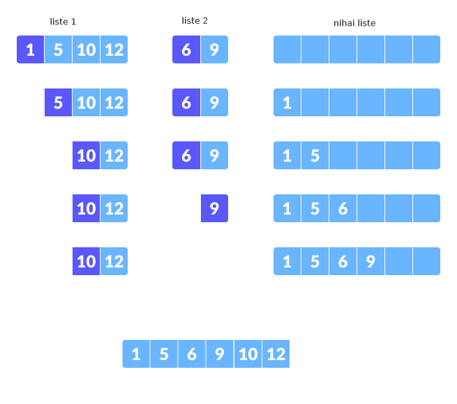

# Paralel Veri Analizi Istatistik

Eşzamanlı olarak veri işleme, analizi tekniklerinin temel yaklaşımını
[2]'de gördük, orada ve bu yazıda kullanacağımız ana yapı şöyle;
İşlenecek çok büyük bir CSV dosyası var, her çekirdek (birden fazla
ise) her makina by dosyaya direk erisebilir, paralel işlemler bu
dosyanın farklı kısımlarını ayna anda işleyebilmek üzerinden
gerçekleşecektir. Tercihimiz her zaman satır satır mesafe katedebilen
algoritmalardır, yani verinin tek bir satırına bakarak bir bir
katmadeğer elde edebilen, sonuca daha yaklaşabilen algoritmalar.

### Sıralama (Sorting)

Paralel sıralama için önemli numara dosyanın ufak parçalarını hafızada
sıralamak, onları diske yazmak, sonra sıralanmış parçaları artık disk
bazlı (satır satır) birleştirebilmek.

Sıralanmış parçaların sıralanmış halde birleşmiş hale gelmesi için
(merge) bir algoritma,

* Her iki parçanın başına git

* Bir döngü içinde her ikisinin sıradaki en küçük parçasına bak

* En ufak olanını al, yeni listeye ekle, bunu tekrarla

* Listeler farklı boylarda olabilir, bir liste öncekinden önce biterse
  önemli değil, kalan listeyi olduğu gibi yeni listeye ekle.

Altta bu işlemleri gösteren bir örnek görüyoruz.



Listeden bir öğe alındığında o öğeyi "çıkartılmış" gibi gösterdik,
fakat kodlama bağlamında yapılan bir indisin ilerletilmesinden ibaret.

Tarif edilen birleştirmenin işlediğini alttaki ufak kodda
görebiliriz. İki tane rasgele veri içeren liste yarattık, onları önce
hafızada sıraladık, sonra teker teker her birinden en ufak öğeyi
alarak yeni listeyi oluşturduk, ve yeni liste otomatik olarak
sıralanmış hale geldi.

```python
import numpy as np, random, util

def chunkmerge():
    N1 = 5; N2 = N1*2
    
    # rasgele sayilarla iki liste uret
    arr1 = [random.randint(0,100) for i in range(N1)]
    arr2 = [random.randint(0,100) for i in range(N2)]
    
    arr1 = sorted(arr1) # parcayi hafizada sirala
    arr2 = sorted(arr2) # parcayi hafizada sirala
    print ('liste 1',arr1)
    print ('liste 2',arr2)

    res = [] # sonuclar
    
    i=0; j=0 # her iki listenin farkli indisi var
    while i<N1 and j<N2:
        # her iki listenin islenmemis en kucuk degerine bak, arr1[i], arr2[j]
        # kucuk olanini al
        if arr1[i] < arr2[j]:
            res.append(arr1[i])
            i = i + 1
        else:
            res.append(arr2[j])
            j = j + 1
            
    # kalan ogeleri direk transfer et
    while i<N1:
        res.append(arr1[i])
        i = i + 1
    while j<N2:
        res.append(arr2[j])
        j = j + 1
    print ('siralanmis liste',res)
    # iki listeyi birlestirip klasik sekilde sirala
    arrsorted = sorted(arr1 + arr2)
    # ayni sonuc mu
    print ('Siralama isledi mi?',arrsorted == res)

chunkmerge()   
```

```text
liste 1 [2, 33, 43, 49, 83]
liste 2 [5, 29, 32, 48, 52, 59, 60, 73, 81, 93]
siralanmis liste [2, 5, 29, 32, 33, 43, 48, 49, 52, 59, 60, 73, 81, 83, 93]
Siralama isledi mi? True
```

Disk bazlı işlemleri göstermek için sentetik veri üretelim, sadece bir
kimlik (id) kolonu, iki tane isim, adres için metinsel iki kolon.

```python
import util
util.create_sort_synthetic(1000000)
```

```python
! head -5 /tmp/input.csv
```

```text
83473,nnnnnnnnnnnnnnnnnnnn,nnnnnnnnnnnnnnnnnnnn
46657,nnnnnnnnnnnnnnnnnnnn,nnnnnnnnnnnnnnnnnnnn
98157,HHHHHHHHHHHHHHHHHHHH,HHHHHHHHHHHHHHHHHHHH
111152,CCCCCCCCCCCCCCCCCCCC,CCCCCCCCCCCCCCCCCCCC
```

1 milyon satırlık karışık bir veri oldu.


```python
import os, numpy as np, util

class SplitSortJob:
    def __init__(self):
        self.ci = -1
        self.res = [] # satirlari burada biriktir
    def exec(self,line):
        toks = line.strip().split(',')
        self.res.append(toks)
    def post(self):
        df = pd.DataFrame(self.res) # birikmis satirlarla DataFrame yarat
        df[0] = pd.to_numeric(df[0])
        df = df.sort_values(by=0) # hafizada sirala
        # diske yaz
        df.to_csv("/tmp/L-%d.csv" % self.ci,index=None,header=None)
        
util.process(file_name='/tmp/input.csv', ci=0, N=4, hookobj = SplitSortJob())
```


### Kümeleme (KMeans)

Daha önce [1] yazısında bu işi eşle/indirge, Hadoop ortamında nasıl
yapacağımızı gördük. Eğer [2]'deki yöntemi kullanmak istiyorsak, yani
altyapı bir veriyi herhangi bir kritere göre (çoğunlukla basit bloklar
üzerinden) bölmemizi sağlıyor ve her bölüm üzerinde ayrı bir süreç
işliyor, o zaman bazı kavramlarda birkaç değişiklik gerekir. 

Kaynaklar

[1] [Paralel KMeans, Hadoop](2013/10/paralel-kmeans-hadoop.html)

[2] Bayramli, [Paralel, Satır Bazlı Dosya İşlemek](../../2016/02/toptan-islemler-paralelizasyon.html)

[3] Wikipedia, [External Sorting](https://en.wikipedia.org/wiki/External_sorting)

[4] https://en.wikipedia.org/wiki/K-way_merge_algorithm

[5] https://stackoverflow.com/questions/29494594/sorting-data-with-space-contrainsts

