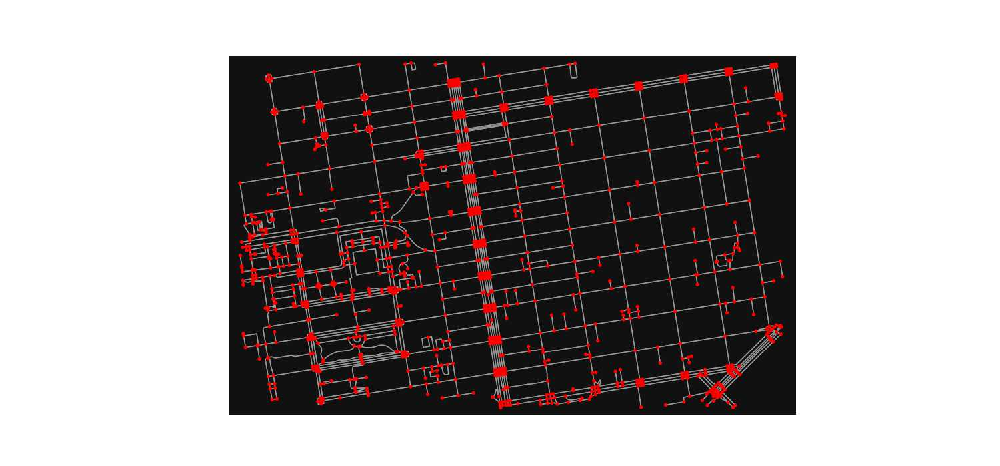

# En Kısa Yol Algoritması, Yol Ağı, OSMNX

OpenStreetMap verisi tüm dünya coğrafi verilerini kapsayan açık
kaynak, herkesin bilgi ekleyebildiği devasa bir veri deposudur, bedava
olarak paylaşılır. İçinde yollar, restoranlar, dükkanlar, önemli
yerler gibi pek çok coğrafi bilgileri içerir. Fakat veriyi işlemek
bazıları için zor olabilir.

Bu verinin daha rahat işlenmesini sağlayan bir paket OSMNX. Özellikle
yol ağ yapısını rahat şekilde indirilmesini ve çizit (graph) olarak
doğru şekilde gelmesini sağlıyor. Çizitler bilindiği gibi matematiğin
bir dalı, bize düğüm-bağlantı yapılarını işleyen algoritmalar sağlar,
tabii ki bir yol ağı çizit teorisinin en bariz uygulama alanıdır,
düğümler duraklar, köşe başları vs olabilir bağlantılar onlar
arasındaki yollar olacaktır.

OSMNX kullanıcının tanımladığı bölgeler içindeki yol yapısını döndürme
kabiliyetine sahiptir, ve bu veriyi diskte onbellekleme yaparak
saklayabilir, böylece aynı bölge için sonraki yükleme çağrılarının
OSM'e bağlanması gerekmez. Eğer veride çizit yapısına uymayan yerler
varsa bunlar döndürülmeden önce tamir edilir. Örnek olarak [1]'deki
gösterile örnek yere bakalım,

```python
import matplotlib.pyplot as plt
import osmnx as ox

ox.config(use_cache=True, cache_folder='/tmp/osmnx')

north, south, east, west = 37.79, 37.78, -122.41, -122.43

G = ox.graph_from_bbox(north, south, east, west, network_type="walk")
```

```python
fig, ax = ox.plot_graph(G, node_color="r",show=False, figsize=(15,7))
plt.savefig('osmnx-01.jpg',quality=50)
```




`cache_folder` ile önbellek dosyalarının yazılacağı yer tanımlandı. Üstteki çağrı
için baktık `30 520ecdb05972a5893b8a541266157cd0b30a6381.json` diye bir dosya
oraya yazılmış, büyüklüğü 1.8 MB. `graph_from_bbox` ile belli kuzey, güney, doğu,
batı üç noktalarının oluşturduğu kutunun içine düşen yol ağını aldık, fakat
tek bir nokta verip ona belli uzaklıktaki tüm yol ağını da alabilirdik, mesela
`graph_from_point((37.79, -122.41), dist=750` ile verili noktanın 750
metre çevresindeki ağ alınabilir.

Network tipi `network_type` ile tanımlanabilir, `walk`, `drive`, `bike`
değerleri geçilebiliyor, bu değerler sırasıyla arabaların geçebildiği, ya da
bisiklet, ya da yürünebilen yol yapılarını döndürecektir. Uygulamanın
ihtiyacına göre farklı değerler kullanılabilir, arabalarin geçebildiği her
yol bisiklete uygun olmayabilir mesela, bu sebeple bu seçenek gerekli.

Çağrı yapıldı, ve artık geri döndürülen `G` değişkeni içinde yol yapısı var,
buna düğümlerden oluşan bir liste olarak erişilebilir, mesela 0'inci
ve 20'inci düğümler


```python
print (list(G)[0])
print (list(G)[20])
```

```text
65281835
65295347
```

İlk 10 düğüm

```python
print (list(G)[:10])
```

```text
[65281835, 65281838, 65282081, 65282083, 65282130, 65282133, 65282136, 65282140, 65282144, 65285109]
```

Kısa yol bulmaya gelelim; ilk önce eldeki başlangıç ve bitiş coğrafi
kordinatlarına en yakın çizit düğümlerini bulmak lazım,

```python
origin = (37.784825495166544, -122.40208526405367)
destination = (37.79584463577157, -122.40724290129684)
origin_node = ox.distance.nearest_nodes(G, origin[1], origin[0])
destination_node = ox.distance.nearest_nodes(G, destination[1], destination[0])
print (origin_node)
print (destination_node)
```

```text
5429618404
9835210340
```

Görülen iki kimlik değeri düğüm ID.

Şimdi bu düğümler ile yine OSMNX içinde mevcut olan en kısa yol
algoritmasını işletiyoruz,

```python
route = ox.shortest_path(G, origin_node, destination_node)
route[:10]
```

```text
Out[1]: 
[5429618404,
 5429618406,
 65343960,
 65333814,
 1580501206,
 65334120,
 65312401,
 65343962,
 65314158,
 10802171480]
```

Gecilecek yolun ilk 10 dugumunu listeledik. Kısa yol bize yine bir
düğüm ID listesi olarak donduruldu, en kısa yol bu noktalardan
oluşuyor. Bu noktalar hakkında daha detaylı bilgiyi `G` çizit
objesinden alabiliriz, mesela enlem, boylam değerleri bu objeye
sorulabiliyor, ilk noktayı soralım,


```python
G.nodes[route[0]]
```

```text
Out[1]: {'y': 37.7838048, 'x': -122.410132, 'street_count': 1}
```

Tüm noktaları enlem/boylam listesine çevirelim,

```python
coords = [[G.nodes[r]['y'],G.nodes[r]['x']] for r in route]
print (coords)
```

```text
[[37.7838048, -122.410132], [37.7842485, -122.4102223], [37.7841515, -122.4109719], [37.7850815, -122.4111594], [37.7860145, -122.4113476], [37.7869469, -122.4115357], [37.7872177, -122.4115903], [37.7875647, -122.4116603], [37.7878756, -122.411723], [37.7880186, -122.4105956], [37.7882369, -122.4106376], [37.7883078, -122.4101224], [37.7884585, -122.4101529], [37.7885478, -122.410171], [37.7889453, -122.4102515], [37.7890203, -122.4102667], [37.7890994, -122.4102825], [37.7891123, -122.4101922], [37.7898919, -122.4103503], [37.7899644, -122.4103641]]
```

Kordinatları bir Folium haritasında gösterebiliriz artık,

```python
import folium
map = folium.Map(location=origin,zoom_start=16,control_scale=True)
folium.PolyLine(locations=coords, color="red").add_to(map)
map.save('direction1.html')
```

[Tarif](direction1.html)

Haritada görülen kırmızı çizgiler yürünüş için en kısa yolu gösteriyor.

Kaynaklar

[1] [Geoff Boeing](https://geoffboeing.com/2016/11/osmnx-python-street-networks/)

[2] [OSRM Yol Tarifi](../../2016/11/yol-tarifi-harita-bilgisi-osrm-backend.html)

[3] [NetworkX Multidigraph](https://networkx.org/documentation/stable/reference/classes/multidigraph.html)

[4] [OSMNX Belge 1](https://github.com/gboeing/osmnx-examples/blob/main/notebooks/01-overview-osmnx.ipynb)

[5] [OSMNX Belge 2](https://github.com/bryanvallejo16/shortest-path-osm/blob/main/shortest_path_osm_updated_example.ipynb)

[6] [OSMNX Belge 3](https://github.com/gboeing/osmnx-examples/blob/main/notebooks/02-routing-speed-time.ipynb)
