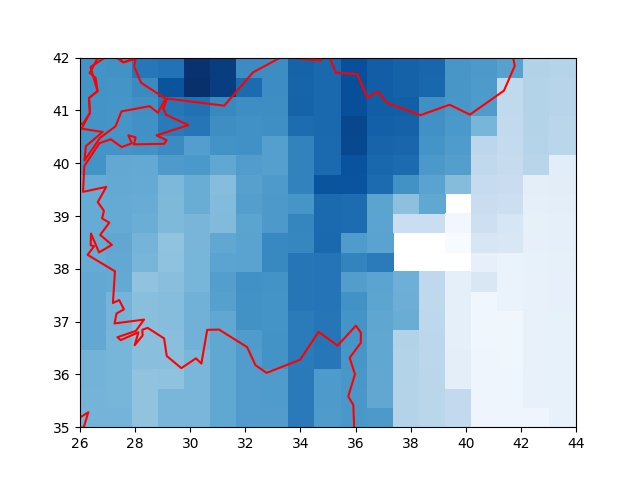

# İklim, Nem Verileri

Havanın nemlilik oranı ay bazlı tarihsel olarak [1] ya da anlık olarak [2]
bağlantısındaki metotlarla alınabilir.

Önce tarihsel verilere bakalım. [1]'den indirilebilecek bazi dosyalar
`HadISDH.landq` ile ya da `HadISDH.landRH` ile baslayan dosyalar,
bunlar sırasıyla bir kg ıslak hava içinde ne kadar g bazında buhar
olduğunu gosteren g/kg birimindeki spesifik nemlilik `q`, ya da birim
hacimdeki buharın o sıcaklıkta tutulabilecek maksimum buhara olan
yüzde olarak oranını gosteren izafi nemlilik `rh`.

Veri indirilip

```python
import csv, pandas as pd, re
fin = open("/tmp/HadISDH.landq.4.4.0.2021f_FLATgridHOM5by5_anoms9120_actuals.dat")
rd = csv.reader(fin)
fout = open("/tmp/q.csv","w")
for i in range(47*12):
    print ('i',i)
    date_line = next(rd)
    date_line = date_line[0].split(" ")
    dt = date_line[1] + "-" + date_line[0]
    dt = pd.to_datetime(dt)
    for j in range(36):
        print ('j',j)
        line = next(rd)
        line = line[0]
        line = re.split('\s*',line)
        line = line[1:]
        line = [str(dt.year), str(dt.month)] + line
        res = ";".join(line)
        res = res.replace("-9999.99","")
        fout.write(res)
        fout.write("\n")
        fout.flush()
    fout.flush()
```

ile işlenebilir. Okunan dosya formatı biraz garip aslında, tarihler ay
olarak bir blok üzerine düz tarih olarak yazılmış, ve dosyanın en
sonunda her bloğun kolonlarının ve satırlarının tekabül ettiği enlem,
boylam ızgara noktaları verilmiş. Biz Pandas gibi ürünlerle çalışmaya
alışık olduğumuz için her satırda gerekli bilgiyi içeren normalize
edilmiş verilerle iş yapmaya daha alışkınız, bizim ürettiğimiz
çıktının formatında sene/ay bilgisi ayrı kolonlarda, ve her satırda
veriliyor, tarih başlık değil ve en sondaki iki satır atlanıyor.
Böylece sene/ay için filtreleme yapılınca gerekli veri bloğu alınır,
dünyanın belli noktalarını temsil eden bu blok 72 x 36 boyutlu bir
matris olacaktır. O matristeki hücrelerin hangi enlem/boylamlara
tekabül ettiğini kod içine sabit değerler olarak gömebiliriz, veriye
dahil etmeye gerek yok. Enlem değerleri -/+87.5 arasında eşit aralığa
bölünmüş 36 satırda, boylam değerleri ise -+177.5 arasında 72 aralığa
bölünmüş kolonlarda olacak.

Şimdi işlenmiş yeni verideki bir aya bakalım,

```python
import util 
year = 2019; month = 8
df = util.get_pd().read_csv('/tmp/q.csv',sep=';',header=None)
df = df[(df[0] == year) & (df[1] == month)]
df = df.iloc[:,2:]
x,y = np.meshgrid(np.linspace(-177.50,177.50,72),np.linspace(-87.50,87.50,36))
util.get_sm().plot_continents(0, 20, zoom=18, incolor='green', outcolor='white', fill=False)
plt.pcolormesh(x,y,df,cmap='Blues')
plt.savefig('iklim01.jpg',quality=40)
```


Fakat eldeki verininin pek detaylı olmadığını biliyoruz çünkü 72 x 36 boyutlu
bir ızgara pek çok alanı atlamış olacaktır. Mesela TR üzerinde odaklanırsak,

```python
year,month = 2019,8
df = util.get_pd().read_csv('/tmp/q.csv',sep=';',header=None)
df = df[(df[0] == year) & (df[1] == month)]
x,y = np.meshgrid(np.linspace(-177.50,177.50,72),np.linspace(-87.50,87.50,36))
df = df.iloc[:,2:]
df = np.array(df).flatten()
xx = x.flatten()[np.isnan(df)==False]
yy = y.flatten()[np.isnan(df)==False]
zz = df[np.isnan(df)==False]

q = util.get_qti()(xx,yy,zz)
interp = np.vectorize(q.interpolate,otypes=[np.float64])
zi = interp(x, y)

util.get_sm().plot_continents(40, 35, zoom=1, incolor='red', outcolor='white', fill=False)
plt.xlim(26,44)
plt.ylim(35,42)
plt.pcolormesh(y,x,zi,cmap='Blues')
plt.savefig('iklim02.jpg',quality=40)
```


gibi bir sonuç alıyoruz.

Günlük Daha Detaylı Veri

O günün verisini kullanarak daha detaylı nemlilik verisini
OpenWeatherMap ile alabiliriz [2]. Gerçi OWM'in tarihi veri servisi de
var fakat bu servis paralı, belli kota altındaki anlık veri alımı
bedava, bu yazı için onu kullanalım. Onları önceden rasgele seçilmiş
belli noktalar için alacağız, `util.coords` içinde,

```python
year,month = 2019,8
util.get_sm().plot_continents(40, 35, zoom=1, incolor='red', outcolor='white', fill=False)
plt.xlim(26,44)
plt.ylim(35,42)
cs = np.array(util.coords)
plt.plot(cs[:,1], cs[:,0], 'r.')
plt.savefig('iklim03.jpg',quality=40)
```

[Noktalar](iklim03.jpg)

Bugünün verisini alalım, erişim için OWM anahtarının alınmış olduğunu
farzediyoruz, bizimki `$HOME` altında `.nomterr.conf` adlı bir JSON
dosyasında, `weatherapi` anahtarına tekabül ediyor,

```python
base_url = 'http://api.openweathermap.org/data/2.5/weather?'

params = json.loads(open(os.environ['HOME'] + "/.nomterr.conf").read())

n = datetime.datetime.now()
ns = n.strftime("%Y-%m-%d")
hums = []
for i in range(len(coords)):
    print (i)
    payload = { 'lat': str(coords[i][0]), 'lon': str(coords[i][1]),'appid': params['weatherapi'] }
    r = requests.get(base_url, params=payload) 
    res = [json.loads(x.decode()) for x in r.iter_lines()]
    hums.append(str(res[0]['main']['humidity']))

line = ns + "," + ",".join(hums) 
fout = open("trall.csv","a")
fout.write(line)
fout.write("\n")
fout.close()
```

Üstteki çağrılar önceden seçilmiş noktalar için o günün verilerini
alıp yeni bir satır olarak çıktı CSV dosyası `trall.csv` ya ekleyecektir.
Grafiklersek,

```python
util.get_sm().plot_continents(40, 35, zoom=1, incolor='red', outcolor='white', fill=False)

df = util.get_pd().read_csv('trall.csv',header=None)
df = df.tail(1)
x = cs[:,0]
y = cs[:,1]
z = np.array(df[list(range(1,28))])[0]

xi,yi = np.meshgrid(np.linspace(35,42,20),np.linspace(26,44,20))

q = util.get_qti()(x,y,z)
interp = np.vectorize(q.interpolate,otypes=[np.float64])
zi = interp(xi, yi)
plt.xlim(26,44)
plt.ylim(35,42)
plt.pcolormesh(yi,xi,zi,cmap='Blues')
plt.savefig('iklim04.jpg')
```



Aradeğerleme için [3]'te anlatılan bir tekniği kullandık. Aradeğerleme
gerekiyor çünkü veri için rasgele noktalar seçtik, fakat grafikleme
için daha detaylı bir ızgara bekleyen `pcolormesh` çağrısı gerekiyor.

Grafikte Kütahya, Denizli, Uşak etrafında az nemli bir bölge
görülüyor, Karadenizde yüksek nemli bazı bölgeler var, doğuda ise nem
daha az.

Kaynaklar

[1] https://www.metoffice.gov.uk/hadobs/hadisdh/downloadLAND.html

[2] <a href="../../2017/09/meteoroloji-verileri-ecmwf-noaa-openweathermap.html">OWM</a>

[3] <a href="../../2012/08/aradegerleme-interpolation.html">Aradeğerleme</a>

