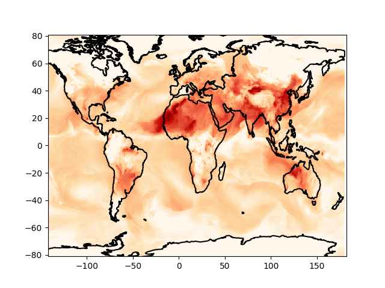

# Hava Kirliliği, SILAM, AQI

SILAM [2] adlı bir kurum hava kirlilik durumu verilerini paylaşıyor.
Bu veriler kullanılarak hava kirliliğini belirten bir özet ölçüt AQI
hesaplanabilir, bu bağlamda Ventusky uygulaması faydalı, zaten onlar da
verisini SILAM'dan alıyor.

https://www.ventusky.com/?p=40.93;32.41;6&l=aqi


OpenWeatherMap sitesinden de yeryüzündeki herhangi bir yer için anlık
hava temizlik durumu alınabilir. Verilen bilgiler yer seviyesi ozon
(O3), partikül kirliliği (PM2.5, PM10), çarbon monoxide (CO), sülfür
diyoksit (s02), nitrogen diyoksit (no2). OWM sitesine bedava kayıt
olup bir anahtar almak yeterli, bu anahtar

```
{
  "weatherapi": "[anahtar buraya]",
  ...
}
```

şeklinde biz bir `.conf` dosyasına yazdık, JSON formatında, anahtarı alıp
alttaki kodla bilgiyi alıyoruz,

```python
import json, requests, os

def pollution(lat,lon):
    url = 'http://api.openweathermap.org/data/2.5/air_pollution?'
    params = json.loads(open(os.environ['HOME'] + "/.nomterr.conf").read())
    payload = { 'lat': str(lat), 'lon': str(lon), 'appid': params['weatherapi'] }
    r = requests.get(url, params=payload)
    res = [json.loads(x.decode()) for x in r.iter_lines()]
    aqi = res[0]['list'][0]['main']
    comp = res[0]['list'][0]['components']
    return aqi, comp


lat,lon = 28.667497225228697, 77.04931436061617
pollution(lat,lon)
```

```text
Out[1]: 
({'aqi': 5},
 {'co': 1642.23,
  'no': 4.81,
  'no2': 52.78,
  'o3': 151.63,
  'so2': 154.5,
  'pm2_5': 277.4,
  'pm10': 318.04,
  'nh3': 5.7})
```

Üstteki sonuçlar Hindistan'ın başkenti Yeni Delhi için, bu sıralarda
hava kirlilik problemi var, ve AQİ maksimum olan 5 seviyesinde çıktı.

SILAM ile tüm dünya için geçmiş tarihteki kirlilik verisi bulunabilir, [1]
bağlantısında dosyalar görülüyor, alttaki kodla `20231104` tarihi için
olan nc4 dosyasını alıyoruz,


```python
import requests, os


def download_silam(f, outdir):
   base_url = "https://silam.fmi.fi/thredds/fileServer/dailysilam_glob06_v5_8/files/"
   target_file = outdir + "/" + f
   url = base_url + "/" + f
   if not os.path.isfile(target_file):
       r = requests.get(url, allow_redirects=True)
       open(target_file, 'wb').write(r.content)

f = 'SILAM-AQstat-glob06_v5_8_2023110400.nc4'
outdir = "/opt/Downloads/silam"
download_silam(f, outdir)
```

Dosyada paylaşılan bilgilere bakalım,

```python
import netCDF4

sf = netCDF4.Dataset(outdir + "/" + f)

for x in sf.variables.keys(): print (x)
```

```text
air_dens
daymax_cnc_PM10
daymax_cnc_PM2_5
daymax_vmr_CO
daymax_vmr_NO
daymax_vmr_NO2
daymax_vmr_O3
daymax_vmr_SO2
daymean_cnc_PM10
daymean_cnc_PM2_5
daymean_vmr_CO
daymean_vmr_NO
daymean_vmr_NO2
daymean_vmr_O3
daymean_vmr_SO2
hybrid
lat
lon
time
```

Bunlardan mesala ortalam PM 2.5 verisi `daymean_cnc_PM2_5`,

```python
sf.variables['daymean_cnc_PM2_5'].shape
```

```text
Out[1]: (7, 1, 297, 600)
```

Sonuç bir tensor olarak geldi. Bu tensor, yani çok boyutlu matris,
görülen boyutlarda, bu boyutların ilki gün içindeki zaman kesiti en
son ikisi sırasıyla enlem ve boylam. Maksimum enlem, boylamın -180,180
ve -90,90 arasında olduğunu biliyoruz, bunları eldeki veri noktasına
bölerek bir izgara yaratabiliriz, ve verileri bu izgarada basabiliriz.

```python
import simplegeomap as sm

x,y = np.meshgrid(np.linspace(-180,180,600),np.linspace(-90,90,297))
z = sf.variables['daymax_cnc_PM2_5'][4,0,:,:] 

z = z * 1e8
z = np.log(z)

sm.plot_continents(0, 20, zoom=18, incolor='black', outcolor='white', fill=False)

plt.pcolormesh(x,y,z,cmap='OrRd')

plt.savefig('hava1.jpg',pil_kwargs={'quality':40})
```



Dikkat log ile bir işlem yapmak gerekti çünkü verinin lineer olmayan
bir sürecin sonucu, çok ekstrem değerler var, çoğu yerde çok düşük
değerler var [3]. Grafikleme amaçlı olarak bir önişlem yapmak gerekti.

OWM zaten bir özet AQI hesaplıyor, SILAM için eldeki bileşenler
kullanılarak [4] bir AQI hesabı yapılabilir.


[1] https://silam.fmi.fi/thredds/catalog/dailysilam_glob06_v5_8/files/catalog.html

[2] https://silam.fmi.fi/aqforecast.html

[3] https://github.com/fmidev/opendata-resources/blob/master/examples/python/timeseries-airquality.ipynb

[4] https://www.health.act.gov.au/about-our-health-system/population-health/environmental-monitoring/air-quality/measuring-air

