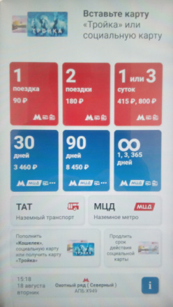

# Rusya'ya Gidiş, Vize, Turistik Bilgiler

Metro

Bilet almak için kullanılacak aletin ekranı, başlangıç hali böyle. Sol
üst köşedeki ilk iki seçenek 1 seyahat, 2 seyahat için, yani bilet tek
kullanımlık, turistler için en rahat olanlar bunlar. Basıyorsunuz,
ardından parayı veriyorsunuz, mesela 1 seyahat seçim sonrası 100 ruble
verince hemen alttan bilet ve para üstü alt kısma düşer. Diğer
seçenekler mesela 30 gün, 90 gün, vs. 

[devam edecek]

